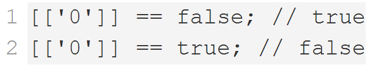
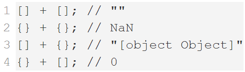
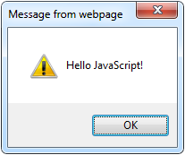
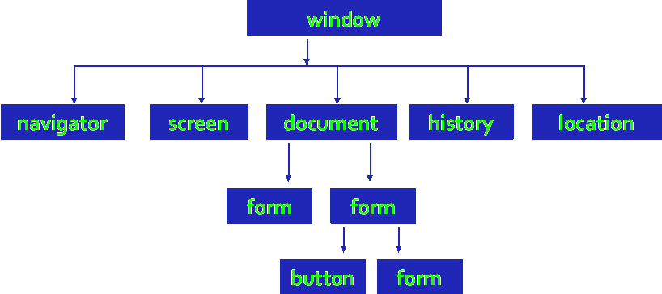
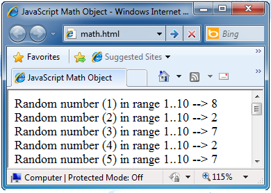

<!-- section start -->
<!-- attr: { hasScriptWrapper:true } -->
# Introduction to JavaScript Development
## The Magic of Dynamic Web Pages
<!--  -->
<div class="signature">
	<p class="signature-course"></p>
	<p class="signature-initiative"></p>
	<a href="https://telerikacademy.com/" class="signature-link"></a>
</div>

<!-- section start -->
<!-- attr: { hasScriptWrapper:true } -->
# Table of Contents
- Dynamic HTML
- How to Create DHTML?
  - XHTML, CSS, JavaScript, DOM
- Intro to JavaScript
  - JavaScript in Web Pages
- JavaScript Syntax 
- Pop-up boxes
- Debugging in JavaScript
<!--  -->

<!-- section start -->
<!-- attr: { hasScriptWrapper:true } -->
# Dynamic HTML
## Dynamic Behavior at the Client Side
<!--  -->
<!--  -->
<!--  -->
<!--  -->

<!-- attr: { hasScriptWrapper:true } -->
# What is DHTML?
- **Dynamic HTML** (**DHTML**)
  - Makes possible a Web page to react and change in response to the user’s actions
- DHTML consists of HTML + CSS + JavaScript


<!-- attr: { hasScriptWrapper:true, style:'font-size:0.9em' } -->
# DTHML = HTML + CSS + JavaScript
- **HTML** defines Web sites **content** through **semantic** tags (headings, paragraphs, lists, …)
- **CSS** defines **'rules**' or **'styles**' for **presenting** every aspect of an HTML document
  - **Font** (family, size, color, weight, etc.)
  - **Background** (color, image, position, repeat)
  - **Position** and **layout** (of any object on the page)
- **JavaScript** defines dynamic behavior
  - **Programming logic** for interaction with the user, to handle events, etc.

<!-- section start -->
<!-- attr: { hasScriptWrapper:true } -->
# JavaScript
## Dynamic Behavior in a Web Page
<!--  -->
<!--  -->
<!--  -->

<!-- attr: { hasScriptWrapper:true } -->
# JavaScript
- **JavaScript** is a front-end scripting language developed by Netscape for dynamic content
  - Lightweight, but with limited capabilities
  - Can be used as object-oriented language
  - Embedded in your HTML page
  - Interpreted by the Web browser
- **Client-side**, **mobile** and **desktop** technology
- Simple and flexible
- Powerful to manipulate the DOM

<!-- attr: { hasScriptWrapper:true } -->
# JavaScript Advantages
- JavaScript allows interactivity such as:
  - Implementing form validation
  - React to user actions, e.g. handle keys
  - Changing an image on moving mouse over it
  - Sections of a page appearing and disappearing
  - Content loading and changing dynamically
  - Performing complex calculations
  - Custom HTML controls, e.g. scrollable table
  - Implementing AJAX functionality


<!-- attr: { hasScriptWrapper:true } -->
# What Can JavaScript Do?
- Can handle events
- Can read and write HTML elements and modify the DOM tree
- Can validate form data
- Can access / modify browser cookies
- Can detect the user's browser and OS
- Can be used as object-oriented language
- Can handle exceptions
- Can perform asynchronous server calls (AJAX)


<!-- attr: { hasScriptWrapper:true } -->
# JavaScript Engines
- Depends on Browser
  - V8 in Chrome, Chakra in IE, Spidermonkey in Firefox, JavaScriptCore for Safari, etc.
- Services
  - Memory Management / GC
  - Just-in-Time Compilation
  - Type System
  - etc.
<!--  -->
<!--  -->


<!-- attr: { hasScriptWrapper:true } -->
# The First Script

```html
<html>

<body>
  <scriрt type="text/javascript">
    alert('Hello JavaScript!');
  </scriрt>
</body>

</html>
```

<!--  -->

<!-- attr: { hasScriptWrapper:true } -->
# Using JavaScript Code
- The JavaScript code can be placed in:
  - **&lt;script&gt;** tag in the head 
  - **&lt;script&gt;** tag in the body - not recommended 
  - External files, linked via **&lt;script&gt;** tag the head
    - Files usually have **.js** extension
    - Highly recommended
    - The **.js** files get cached by the browser

```html
<scriрt src="scripts.js" type="text/javscript">
<!-- code placed here will not be executed! -->
</scriрt>
```

<!-- attr: { hasScriptWrapper:true } -->
# JavaScript – When is Executed?
- JavaScript code is executed during the page loading or when the browser fires an event
  - All statements are executed at page loading
  - Some statements just define functions that can be called later
  - No compile time checks
- Function calls or code can be attached as "event handlers" via tag attributes
  - Executed when the event is fired by the browser

```html

```

<!-- attr: { hasScriptWrapper:true } -->
# Calling a JavaScript Function from Event Handler – _Example_

```html
<html>
<head>
<scriрt type="text/javascript">
  function test (message) {
    alert(message);
  }
</scriрt>
</head>

<body>
  
</body>
</html>
```

<!--  -->

<!-- attr: { hasScriptWrapper:true, style:'font-size:0.9em' } -->
# Using External Script Files
- Using external script files:

```html
<html>
<head>
  <scriрt src="sample.js" type="text/javascript">
  </scriрt>
</head>
<body>
  <button onclick="sample()" value="Call JavaScript
    function from sample.js"/>
</body>
</html>
```
- External JavaScript file:

```js
function sample() {
  alert('Hello from sample.js!')
}
```

<div class="fragment balloon" style="top:36.75%; left:32.74%; width:59.69%">The &lt;script&gt; tag is always empty.</div>
<!--  -->

<!-- section start -->
<!-- attr: { hasScriptWrapper:true } -->
# Node.js Overview
- Node.js is a server-side platform that uses JavaScript
  - Runs the V8 JS interpreter
  - Allows creating end-to-end apps with JavaScript
  - Usable to test & learn JavaScript Syntax

<!-- attr: { hasScriptWrapper:true } -->
# Installing Node.js on Windows
- Visit the Node.js website: https://nodejs.org/
- `Next` -> `Next` -> `Next` -> …
- Make sure Node.js is added to **PATH**
- Node.js is installed on the machine and can be used through the CMD/Terminal
- In the CMD/Terminal run **node -v**
  - Should return the version, if node is installed and working

<!-- attr: { hasScriptWrapper:true } -->
# Installing Node.js on Windows
- Go to **Computer** -> **Properties**
<!--  -->

<!-- attr: { hasScriptWrapper:true } -->
# Installing Node.js on Windows
- Go to **Advanced system settings**
<!--  -->

<!-- attr: { hasScriptWrapper:true } -->
# Installing Node.js on Windows
- Go to **Advanced** -> **Environment Variables**
<!--  -->

<!-- attr: { hasScriptWrapper:true } -->
# Installing Node.js on Windows
- Go to **System Variables** -> **Path** -> **Edit**
<!--  -->

<!-- attr: { hasScriptWrapper:true } -->
# Installing Node.js on Windows
- Add to the end:

```
;C:\Program Files\nodejs\
```
<!--  -->

<!-- attr: { hasScriptWrapper:true } -->
# Adding Node.js to Path on Linux and OS X
- It probably already is
- Otherwise
  - Open `~/.bashrc` (or `~/.zshrc`)
  - Find the Node.js path
    - Usually it is `/usr/bin/node`
  - Add the Node.js path to `~/.bashrc`

<!-- section start -->
<!-- attr: { hasScriptWrapper:true } -->
# The JavaScript Syntax
<!--  -->
<!--  -->

<!-- attr: { hasScriptWrapper:true } -->
# JavaScript Syntax
- The JavaScript syntax is similar to C#
  - Operators (**+**, **&#42;**, **=**, **!=**, **&&**, **++**, …)
  - Variables (typeless)
  - Conditional statements (**if**, **else**)
  - Loops (**for**, **while**)
  - Arrays (**my_array[]**) and associative arrays (**my_array['abc']**)
  - Functions (can return value)

<!-- attr: { hasScriptWrapper:true } -->
# Standard Popup Boxes
- Alert box with text and **[OK]** button
  - Just a message shown in a dialog box:
- Confirmation box
  - Contains text, **[OK]** button and **[Cancel]** button:
- Prompt box
  - Contains text, input field with default value:

```js
alert("Some text here");
```

```js
confirm("Are you sure?");
```

```js
prompt ("enter amount", 10);
```

<!-- section start -->
<!-- attr: { hasScriptWrapper:true } -->
# The Built-In Browser Objects
<!--  -->
<!--  -->
<!--  -->

<!-- attr: { hasScriptWrapper:true } -->
# Built-in Browser Objects
- The browser provides some read-only data via:
  - **window**
    - The top node of the DOM tree
    - Represents the browser's window
  - **document**
    - holds information the current loaded document
  - **screen**
    - Holds the user’s display properties
  - **browser**
    - Holds information about the browser

<!-- attr: { hasScriptWrapper:true } -->
# DOM Hierarchy – _Example_


<!-- section start -->
<!-- attr: { hasScriptWrapper:true } -->
# The Math Object
- The **Math** object provides some mathematical functions

```js
for (i = 1; i <= 20; i++) {
  var x = Math.random();
  x = 10 * x + 1;
  x = Math.floor(x);
  document.write(
      "Random number (" +
      i + ") in range " + 
      "1..10 --> " + x + 
      "<br/>");
}
```

<!--  -->

<!-- attr: { hasScriptWrapper:true } -->
# The Date Object
- The **Date** object provides date / calendar functions

```js
var now = new Date();
var result = "It is now " + now;
document.getElementById("timeField")
  .innerText = result;
...
<p id="timeField"></p>
```

<!--  -->

<!-- attr: { hasScriptWrapper:true } -->
# The Date Object
- Make something happen (once) after a fixed delay

```js
var timer = setTimeout(bang, 5000);
```


```js
clearTimeout(timer);
```

<div class="fragment balloon" style="top:41.81%; left:40.33%;">5 seconds after this statement executes, this function is called</div>
<div class="fragment balloon" style="top:52.03%; left:22.28%">Cancels the timer</div>

<!-- attr: { hasScriptWrapper:true } -->
# The Date Object
- Make something happen repeatedly at fixed intervals

```js
var timer = setInterval(clock, 1000);
```

```js
clearInterval(timer);
```

<div class="fragment balloon" style="top:40.41%; left:42.03%; width:47.89%">This function is called continuously per 1 second.</div>
<div class="fragment balloon" style="top:52.23%; left:25.69%; width:29.09%">Stop the timer.</div>


<!-- attr: { hasScriptWrapper:true } -->
# Timer – _Example_

```html
<scriрt type="text/javascript">
  function timerFunc() {
    var now = new Date();
    var hour = now.getHours();
    var min = now.getMinutes();
    var sec = now.getSeconds();
    document.getElementById("clock").value = 
      "" + hour + ":" + min + ":" + sec;
  }
  setInterval(timerFunc, 1000);
</scriрt>
<input type="text" id="clock" />
```

<!-- section start -->
<!-- attr: { hasScriptWrapper:true } -->
# Debugging JavaScript
<!--  -->
<!--  -->

<!-- attr: { hasScriptWrapper:true } -->
# Debugging JavaScript
- Modern browsers have JavaScript console where errors in scripts are reported
  - Errors may differ across browsers
- Several tools to debug JavaScript
  - Microsoft Script Editor
    - Add-on for Internet Explorer
    - Supports breakpoints, watches
    - JavaScript statement **debugger**; opens the script editor 

<!-- attr: { hasScriptWrapper:true } -->
# Firebug
- Firebug – Firefox add-on for debugging JavaScript, CSS, HTML
  - Supports breakpoints, watches, JavaScript console editor
  - Very useful for CSS and HTML too
    - You can edit all the document real-time: CSS, HTML, etc
    - Shows how CSS rules apply to element
  - Shows Ajax requests and responses
  - Firebug is written mostly in JavaScript

<!--  -->

<!-- attr: { hasScriptWrapper:true } -->
# Debugging Node.js
- JavaScript can also be debugged with Node.js:
  - Open Terminal/CMD
  - Run
  - In CMD/Terminal, navigate to the folder of the file to debug
  - Run in
  - A browser opens with the code, and it can be debugged

```js
$ npm install –g node-inspector
```

```js
$ node-debug FILE_TO_DEBUG
```

<!-- attr: { hasScriptWrapper:true } -->
# JavaScript Console Object
- The **console** object exists only if there is a debugging tool that supports it
  - Used to write log messages at runtime
- Methods of the **console** object:
  - **debug(message)**
  - **info(message)**
  - **log(message)**
  - **warn(message)**
  - **error(message)**


<!-- attr: { hasScriptWrapper:true } -->
# Introduction JavaScript Development
- Questions?


<!-- attr: { hasScriptWrapper:true } -->
# Free Trainings @ Telerik Academy
- "Web Design with HTML 5, CSS 3 and JavaScript" course @ Telerik Academy
    - html5course.telerik.com
  - Telerik Software Academy
    - academy.telerik.com
  - Telerik Academy @ Facebook
    - facebook.com/TelerikAcademy
  - Telerik Software Academy Forums
    - forums.academy.telerik.com
<!--  -->
<!--  -->
<!--  -->
<!--  -->


