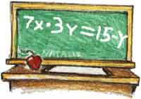

<!-- section start -->
# Operators and Expressions
## Performing Simple Calculations with JavaScript
<!--  -->
<div class="signature">
	<p class="signature-course"></p>
	<p class="signature-initiative"></p>
	<a href="" class="signature-link"></a>
</div>


<!-- section start -->
# Table of Contents
- Operators in JavaScript 
- Arithmetic Operators
- Logical Operators
- Bitwise Operators
- Comparison Operators
- Assignment Operators
- Other Operators
- Operator Precedence
- Expressions
<!--  -->


<!-- section start -->
# Operators in JavaScript
## Arithmetic, Logical, Comparison, Assignment, Etc.
<!--  -->
<!--  -->


# What is an Operator?
- **Operator** is an operation performed over data at runtime
  - Takes one or more arguments (operands)
  - Produces a new value
- Operators have precedence
  - Precedence defines which will be evaluated first
- **Expressions**are sequences of operators and operands that are evaluated to a single value


# Operators in JavaScript
- Operators in JavaScript :
  - **Unary** – take one operand
  - **Binary** – take two operands
  - **Ternary** (**?:**) – takes three operands
- Except for the assignment operators, all binary operators are left-associative
- The assignment operators and the conditional operator (**?:**) are right-associative
<!--  -->


<!-- section start -->
# Arithmetic Operators
<!--  -->


# Arithmetic Operators
- Arithmetic operators **+**, **-**, *****, **/** are the same as in math 
- Division operator **/** returns number or  **Infinity** or **NaN**
- Remainder operator **%** returns the remainder from division of numbers
  - Even on real (floating-point) numbers
- The special addition operator **++** increments a variable


# Arithmetic Operators – _Example_

```js
var squarePerimeter = 17;
var squareSide = squarePerimeter / 4.25;
var squareArea = squareSide * squareSide;
console.log(squareSide); // 4.25
console.log(squareArea); // 18.0625
var a = 5;
var b = 4;
console.log( a + b ); // 9
console.log( a + b++ ); // 9
console.log( a + b ); // 10
console.log( a + (++b) ); // 11
console.log( a + b ); // 11

console.log(12 / 3); // 4
console.log(11 / 3); // 3.6666666666666665
```


```js
console.log(11 % 3);   // 2
console.log(11 % -3);  // 2
console.log(-11 % 3);  // -2

console.log(1.5 / 0.0);  // Infinity
console.log(-1.5 / 0.0); // -Infinity
console.log(0.0 / 0.0);  // NaN

var x = 0;
console.log(5 / x);
```


# Arithmetic Operators
## [Demo]()
<!--  -->


<!-- section start -->
# Logical Operators
<!--  -->


# Logical Operators
- Logical operators take boolean operands and return boolean result
- Operator **!** turns **true** to **false** and **false** to **true** 
- Behavior of the operators **&&**, **||** and **^** (**1** == **true**, **0** == **false**) :


# Logical Operators – _Example_
- Using the logical operators:

```js
var a = true;
var b = false;
console.log(a && b); // False
console.log(a || b); // True
console.log(a ^ b); // True
console.log(!b); // True
console.log(b || true); // True
console.log(b && true); // False
console.log(a || true); // True
console.log(a && true); // True
console.log(!a); // False
console.log((5>7) ^ (a==b)); // False
```


# Logical Operators
## [Demo]()
<!--  -->
<!--  -->


<!-- section start -->
# Bitwise Operators
<!--  -->


# Bitwise Operators
- Bitwise operator **~** turns all **0** to **1** and all **1** to **0**
  - Like **!** for boolean expressions but bit by bit
- The operators **|**, **&** and **^** behave like **||**, **&&** and **^** for boolean expressions but bit by bit
- The **<<** and **>>** move the bits (left or right)
- Behavior of the operators**|**, **&** and **^**:


- Bitwise operators are used on integer numbers
- Bitwise operators are applied bit by bit
- _Example_s:

```js
var a = 3;                // 00000000 00000011
var b = 5;                // 00000000 00000101
console.log( a | b);      // 00000000 00000111
console.log( a & b);      // 00000000 00000001
console.log( a ^ b);      // 00000000 00000110
console.log(~a & b);      // 00000000 00000100
console.log( true << 1);  // 00000000 00000010
console.log( true >> 1);  // 00000000 00000000

```


# Bitwise Operators
- [Demo]()
<!--  -->
<!--  -->


<!-- section start -->
# Comparison and Assignment Operators
<!--  -->


# Comparison Operators
- Comparison operators are used to compare variables
  - **==**, **<**, **>**, **>=**, **<=**, **!=**,**===**,**!==**
- Comparison operators example:

```js
var a = 5;
var b = 4;
console.log(a >= b); // True
console.log(a != b); // True
console.log(a == b); // False
console.log(0 == ""); // True
console.log(0 === ""); //False
```

<!--  -->


# Assignment Operators
- Assignment operators are used to assign a value to a variable
  - **=**, **+=**, **-=**, **|=**, ...
- Assignment operators example:

```js
var x = 6;
var y = 4;
console.log(y *= 2); // 8
var z = y = 3; // y=3 and z=3  
console.log(z); // 3
console.log(x |= 1); // 7
console.log(x += 3); // 10
console.log(x /= 2); // 5
```

<!--  -->


# Comparison and Assignment Operators
- [Demo]()
<!--  -->


<!-- section start -->
# Other Operators
<!--  -->


# Other Operators
- String concatenation operator **+** is used to concatenate strings 
- If the second operand is not a string, it is converted to string automatically

```js
var first = "First";
var second = "Second";
console.log(first + second); // FirstSecond
var output = "The number is : ";
var number = 5;
console.log(output + number);
// The number is : 5
```

<!--  -->


- Member access operator  **.**  is used to access object members
- Square brackets **[]** are used with arrays indexers and attributes
- Parentheses **(** **)** are used to override the default operator precedence


- Conditional operator **?:** has the form
  - (if **b** is true then the result is **x** else the result is **y**)
- The **new** operator is used to create new objects 
- The **typeof** operator returns the type of the object 
- **t****his** operator references the current context
  - In JavaScript the value this depends on the current scope

```js
b ? x : y
```


# Other Operators – _Example_
- Using some other operators:

```js
var a = 6;
var b = 4;
console.log(a > b ? 'a>b' : 'b>=a'); // a>b
var c = b = 3; // b=3; followed by c=3;
console.log(c); // 3
console.log(a is int); // True
console.log((a+b)/2); // 4
console.log(typeof(int)); // System.Int32
```


# Other Operators
- [Demo]()
<!--  -->


<!-- section start -->
# Operators Precedence
<!--  -->


- Parenthesis operator always has highest precedence
- _Note_: prefer using **parentheses**, even when it seems stupid to do so


<!-- section start -->
# Expressions
<!--  -->


# Expressions
- Expressions are sequences of operators, literals and variables that are evaluated to some value
- _Example_s:

```js
var r = (150-20) / 2 + 5; // r=70
// Expression for calculation of circle area
var surface = Math.PI * r * r;
// Expression for calculation of circle perimeter
var perimeter = 2 * Math.PI * r;
```


- **Expressions** has:
  - Type (integer, real, boolean, ...)
  - Value
- _Example_s:

```js
var a = 2 + 3; // a = 5
var b = (a+3) * (a-4) + (2*a + 7) / 4;  // b = 12
var greater = (a > b) || ((a == 0) && (b == 0));
```

<div class="fragment balloon" style="top:67.77%; left:15.15%; width:61.54%">Expression of type **boolean**. Calculated at runtime.</div>
<div class="fragment balloon" style="top:34.14%; left:31.47%; width:64.80%">Expressions of type **Number**. Calculated at runtime.</div>
<div class="fragment balloon" style="top:34.14%; left:31.55%; width:64.72%">Expression of type **Number**. Calculated at compile time.</div>


# Expressions
- [Demo]()
<!--  -->


# Operators and Expressions
<!--  -->


# Free Trainings @ Telerik Academy
- "Web Design with HTML 5, CSS 3 and JavaScript" course @ Telerik Academy
    - html5course.telerik.com
  - Telerik Software Academy
    - academy.telerik.com
  - Telerik Academy @ Facebook
    - facebook.com/TelerikAcademy
  - Telerik Software Academy Forums
    - forums.academy.telerik.com
<!--  -->
<!--  -->
<!--  -->
<!--  -->


