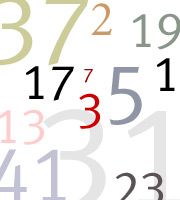
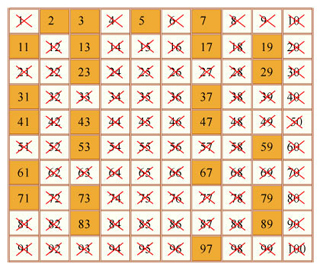
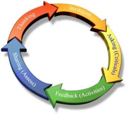

<!-- section start -->
# Loops
## Execute Blocks of Code Multiple Times
<!--  -->
<!--  -->
<div class="signature">
	<p class="signature-course"></p>
	<p class="signature-initiative"></p>
	<a href="" class="signature-link"></a>
</div>


<!-- section start -->
# Table of Contents
- What is a Loop?
- Loops in JavaScript
  - **while** loops
  - **do** … **while** loops
  - **for** loops
- Special loop operators
  - **break**, **continue**
- Nested loops
<!--  -->


# What Is Loop?
- A **loop** is a control statement that allows repeating execution of a block of statements
  - May execute a code block fixed number of times
  - May execute a code block while given condition holds
  - May execute a code block for each member of a collection
- Loops that never end are called an **infinite****loops**


<!-- section start -->
# Using while(…) Loop
<!--  -->


# How To Use While Loop?
- The simplest and most frequently used loop
- The repeat condition
  - Also called **loop condition**
  - Is not necessary true or false
  - Is evaluated to **true** or **false**
    - 5, "non-empty", etc.. are evaluated as true
    - 0, "", null are evaluated as false

```js
while (condition) {
    statements;
}
```


# While Loop – How It Works?
- true
- condition
- statement
- false


# While Loop – _Example_

```js
  var counter = 0;
  while (counter < 10) {
      console.log('Number : ' + counter);
      counter+=1;
  }
```

<!--  -->


<!-- section start -->

<!--  -->


# Sum 1..N – _Example_
- Calculate and print the sum of the first N natural numbers

```js
  var nStr = '123',
      n = +nStr,
      number = 1,
      sum = 1,
      result = 'The sum 1';
  while (number < n) {
      number += 1;
      sum += number ;
      result += '+' + number;
  }
  result += ' = ' + sum;
  console.log(result);
```


# Prime Number – _Example_
- Checking whether a number is prime or not

```js
  var numberStr = '123';
  var number = +numberStr;
  var divider = 2;
  var maxDivider = Math.sqrt(number);
  var prime = true;
  while (prime && (divider <= maxDivider)) {
     if (!(number % divider)) {
         prime = false;        
     }
     divider++;
  }
  print('output-tb',prime);
```


# While Loop
<!--  -->
<!--  -->


# Using break Operator
- **break** operator exits the inner-most loop

```js
  var numberStr = '123‘,
      n = +numberStr,
      fact = 1,
      factStr = 'n! = ';
  while (1) { //infinite loop
    if (n === 1) {
        break;
    }
    factStr += n + '*'
    fact *= n;
    n -= 1;
  }	
  factStr += '1 = ' + fact;
  console.log(factStr);
```


# Calculating Factorial
<!--  -->


<!-- section start -->
# do { … } while (…)Loop
<!--  -->


# Using Do-While Loop
- Another loop structure is:
- The block of statements is repeated
  - While the boolean loop condition holds
- The loop is executed at least once

```js
  do {
      statements;
  } while (condition);
```

<!--  -->


# Do-While Statement
- true
- condition
- statement
- false


<!-- section start -->

<!--  -->


# Factorial – _Example_
- Calculating N factorial

```js
  var fact = 1,
      factStr = 'n! = ';
  do {
    fact *= n;
    factStr += n + '*'
    n -= 1;
  } while (n);
  factStr += ' = ' + fact;
  console.log(factStr)
```


# Product[N..M] – _Example_
- Calculating the product of all numbers in the interval [n..m]:

```js
  var number = n,
      product = 1,
      productStr = '';
  do {		
    product *= number;		
    productStr += number;
    if (number != m) {
    	productStr += '*';
    }
    number += 1;
  } while (number <= m);
  productStr += ' = ' + product;
  console.log(productStr);
```


# do-while Loop
<!--  -->


<!-- section start -->
# for Loops
<!--  -->


# For Loops
- The typical **for** loop syntax is:
- Consists of
  - Initialization statement
  - Test expression that is evaluated to boolean
  - Update statement
  - Loop body block

```js
  for (initialization; test; update) {    statements;}
```


# The Initialization Expression

```js
  for (var number = 0; number < 10; number += 1) {    // Can use number here}// Cannot use number here
```

- Executed once, just before the loop is entered
  - Like it is out of the loop, before it
- Usually used to declare a counter variable


# The Test Expression
- Evaluated before each iteration of the loop
  - If evaluated **true**, the loop body is executed
  - If evaluated **false**, the loop body is skipped
- Used as a **loop condition**

```js
  for (var number = 0; number < 10; number += 1) {    // Can use number here}// Cannot use number here
```


# The Update Expression

```js
  for (var number = 0; number < 10; number += 1) {    // Can use number here}
```

- Executed at each iteration **after** the body of the loop is finished
- Usually used to update the counter


<!-- section start -->
# for Loop
<!--  -->


# Simple for Loop – _Example_
- A simple for-loop to print the numbers 0…9:

```js
  var number;
  for (number = 0; number < 10; number += 1) {
      console.log(number + ' ');
  }
```

- A simple for-loop to calculate n!:

```js
  var factorial = 1,
  	 i;
  for (i = 1; i <= n; i += 1) {
      factorial *= i;
  }
```


# Complex for Loop – _Example_
- Complex **for**-loops could have several counter variables:

```js
  var i, sum;
  for (i=1, sum=1; i<=128; i=i*2, sum+=i) {
      console.log('i=' + i + ', sum=' +sum);
  }
```


```js
  i=1, sum=1
  i=2, sum=3
  i=4, sum=7
  i=8, sum=15
  ...
```

- Result:


# N^M – _Example_
- Calculating **n** to power **m** (denoted as **n^m**):

```js
  var result = 1,
  	 i;
  for (i = 0; i < m; i += 1) {
  	result *= n;
  }
  
  console.log(result);
```


# Calculating N^M
<!--  -->


<!-- section start -->
# Nested Loops
<!--  -->


# What Is Nested Loop?
- A composition of loops is called a **nested loop**
  - A loop inside another loop
- _Example_:

```js
  for (initialization; test; update) {
      for (initialization; test; update) {		
          statements;
      }
      …
  } 
```


<!-- section start -->
# Nested Loops
<!--  -->


# Triangle – _Example_
- Print the following triangle:
    - 1
    - 1 2
    - …
    - 1 2 3 ... n

```js
   var resultStr = '',
	row, col;
   for(row = 1; row <= n; row += 1) {
      for(column = 1; column <= row; column += 1) {
         resultStr += column + ' ';
      }
      resultStr += '\n';
  }	
  console.log(resultStr);
```


# Triangle
<!--  -->


# Primes[N, M] – _Example_
- Print all prime numbers in the interval [n, m]:

```js
var result='',
    number, isPrime, divider, maxDivider;
for (number = n; number <= m; number++) {
  isPrime = true;
  divider = 2;
  maxDivider = Math.sqrt(number);
  while (divider <= maxDivider) {
    if (!(number % divider)) {
      isPrime = false;
      break;
    }
    divider += 1;
  }
  if (isPrime) {
  	result += number + ' ';
  }
}
```


# Primes in Range [n, m]
<!--  -->


<!-- section start -->
# Loops – More _Example_s
<!--  -->


# Nested Loops – _Example_s
- Print all four digit numbers in format **ABCD** such that **A**+**B** = **C**+**D** (known as happy numbers)

```js
  var a, b, c, d
  for (a =1 ; a <= 9; a += 1) {
      for (b = 0; b <= 9; b += 1)
        for (c = 0; c <= 9; c += 1)
          for (d = 0; d <= 9; d += 1)
            if (a + b == c + d)
              console.log('{0}{1}{2}{3}',
                a, b, c, d);
  }
```

<div class="fragment balloon" style="top:25.84%; left:69.64%; width:34.99%">Can you improve this algorithm to use 3 loops only?</div>


# Nested Loops – _Example_s
- Print all combinations from TOTO 6/49

```js
  var i1, i2, i3, i4, i5, i6;
  for (i1 = 1; i1 <= 44; i1+=1)
    for (i2 = i1 + 1; i2 <= 45; i2+=1)
      for (i3 = i2 + 1; i3 <= 46; i3+=1)
        for (i4 = i3 + 1; i4 <= 47; i4+=1)
          for (i5 = i4 + 1; i5 <= 48; i5+=1)
            for (i6 = i5 + 1; i6 <= 49; i6+=1)
              console.log('{0} {1} {2} {3} {4} {5}',
                i1, i2, i3, i4, i5, i6);		
```

<div class="fragment balloon" style="top:21.52%; left:67.00%; width:34.99%">Warning: execution of this code could take too long time.</div>


<!-- section start -->


# for-in Loop
- **for-in loop** iterates over the properties of an object
  - When the object is **array**, **nodeList** or **liveNodeList** for-in iterates over their **elements**
  - When the **object** is not an array, for-in iterates over **its properties**


- Iterating over the elements of an array 
- Iterating over the properties of **document**

```js
  var prop;
  for(prop in document){ console.log(document[prop]); }
  
  //http://localhost:64765/xxx%20for-in-loop.html
  //function querySelector() { [native code] }
  //function querySelectorAll() { [native code] }
  //function evaluate() { [native code] }
```


```js
  var arr = [1, 2, 3, 4, 5, 6],
      index;
  for(index in arr) { console.log(arr[index]); }
  //1, 2, 3, 4, 5, 6
```


<!-- section start -->


# The for-of loop
- The for-of loop iterates over the elements in an array
  - Can be used only on arrays, or array-like objects
    - i.e. the arguments object

```js
  var arr = ['One', 'Two', 'Three', 'Four'];
  for(var n of arr) { 
    console.log(n); 
  }
  //prints 'One', 'Two', 'Three' and 'Four'
```

- The for-of loop is part of the ECMAScript 6 standard
    - Supported in all modern browsers


<!-- section start -->


# Loops
<!--  -->
<!--  -->
<!--  -->
<!--  -->


# Free Trainings @ Telerik Academy
- "Web Design with HTML 5, CSS 3 and JavaScript" course @ Telerik Academy
    - html5course.telerik.com
  - Telerik Software Academy
    - academy.telerik.com
  - Telerik Academy @ Facebook
    - facebook.com/TelerikAcademy
  - Telerik Software Academy Forums
    - forums.academy.telerik.com
<!--  -->
<!--  -->
<!--  -->
<!--  -->


