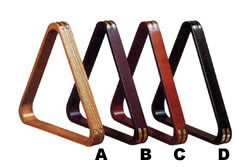
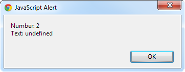

<!-- section start -->
# Functions
## Reusable parts of Code
<!--  -->
<!--  -->
<div class="signature">
	<p class="signature-course"></p>
	<p class="signature-initiative"></p>
	<a href="" class="signature-link"></a>
</div>


<!-- section start -->
# Table of Contents
- Functions Overview
  - Declaring and Creating Functions
  - Calling Functions
- Functions with Parameters
- The arguments Object
- Returning Values From Functions
- Function Scope
- Function Overloading


<!-- section start -->
# Functions Overview
## What is a function?
<!--  -->
<!--  -->


# What is a Function?
- A **function** is a kind of building block that solves a small problem
  - A piece of code that has a name and can be called from the other code
  - Can **take parameters**and **return a value**
- Functions allow programmers to construct large programs from simple pieces
<!--  -->


# Why to Use Functions?
- More **manageable** programming
  - **Split large** problems into **small pieces**
  - **Better****organization** of the program
  - Improve code**readability**and**understandability**
  - Enhance**abstraction**
- Avoiding repeating code
    - Improve code **maintainability**
- Code **reusability**
  - Using existing functions several times
<!--  -->


<!-- section start -->
# Declaring and Creating Functions
<!--  -->
<!--  -->


# Declaring and Creating Functions
- Each function has a **name**
  - It is used to call the function
  - Describes its purpose
- Functions in JavaScript does nothave return type

```js
function printLogo() {
    console.log('Telerik Corp.');
    console.log('www.telerik.com');
}
```

<div class="fragment balloon" style="top:52.58%; left:68.43%; width:20.28%">Function name</div>
<!--  -->


# Declaring and Creating Functions
## [Demo]()
<!--  -->


# Ways of Defining a Function
- Functions can be defined in three ways:
  - Using the constructor of the Function object
  - By function declaration
  - By function expression

```js
var print = new Function('console.log("Hello")');
```


```js
function print() { console.log('Hello') };
```


```js
var print = function() { console.log('Hello') };
var print = function printFunc() { console.log('Hello') };
```


<!-- section start -->
# Calling Functions
<!--  -->


# Calling Functions
- To call a function, simply use:
  - The function’s name
  - Parentheses
  - A semicolon (**;**)
- This will execute the code in the function’s body and will result in printing the following:

```js
printLogo();
```


```js
Telerik Corp.
www.telerik.com
```

<!--  -->


- A function can be called from:
  - Any other function
  - Itself (process known as **recursion**)

```js
function print(){
   console.log('printed');
}

function anotherPrint(){
   print();
   anotherPrint();
}
```

<div class="fragment balloon" style="top:63.03%; left:39.87%; width:20.28%">Don't do this at home</div>
<!--  -->


# Declaring and Calling Functions
<!--  -->
<!--  -->


<!-- section start -->
# Functions with Parameters
<!--  -->


# Function Parameters
- To pass information to a function, you can use **parameters**(also known as **arguments**)
  - You can pass zero or several input values
  - Each parameter has а name
  - Parameters are assigned to particular values when the function is called
- Parameters can change the function behavior depending on the passed values


# Defining and Using Function Parameters
- Function’s behavior depends on its parameters 
- Parameters can be of any type
  - **Number**, **String**, **Object**, **Array**, etc.
  - Even **Func****tion**

```js
function printSign(number) {
    if (number > 0)
        console.log('Positive');
    else if (number < 0)
        console.log('Negative');
    else
        console.log('Zero');
}
```

<!--  -->


- Functions can have as many parameters as needed:

```js
function printMax(number1, number2) {
    var max = number1;
    if (number2 > number1)
        max = number2;
    console.log('Maximal number: ' + max);
}
```


# Calling Functionswith Parameters
- To call a function and pass values to its parameters:
  - Use the function’s name, followed by a list of expressions for each parameter
- _Example_s:

```js
printSign(-5);
printSign(balance);
printSign(2 + 3);
printMax(100, 200);
printMax(oldQuantity * 1.5, quantity * 2);
```

<!--  -->


# Functions Parameters – _Example_

```js
function printSign(number) {
  if (number > 0)
    console.log('The number ' + number + ' is positive.');
  else if (number < 0)
    console.log('The number ' + number + ' is negative.');
  else
    console.log('The number ' + number + ' is zero.');
}
function printMax(number1, number2) {
  var max = number1;
  if (max > number1) {
    max = number2;
  }
  console.log('Maximal number: ' + max);
}
```


# Function Parameters
<!--  -->


# Printing Triangle – _Example_
- Creating a program for printing triangles as shown below:
    - 			1
    - 		1	1 2
    - 		1 2	1 2 3
    - 		1 2 3	1 2 3 4
    - 		1 2 3 4	1 2 3 4 5
    - n=5  &rarr;	1 2 3 4 5     n=6  &rarr;	1 2 3 4 5 6
    - 		1 2 3 4	1 2 3 4 5
    - 		1 2 3	1 2 3 4
    - 		1 2	1 2 3
    - 		1	1 2
    - 			1 


# Printing Triangle – _Example_

```js
function pringTriangle(n) {
  var line;
  for (line = 1; line <= n; line += 1) {
    printLine(1, line);
  }
  for (line = n-1; line >= 1; line -= 1) {
    printLine(1, line);
  }

function printLine(start, end) {
  var line='',
      i;
  for (i = start; i <= end; i += 1){
    line += ' ' + i;
  }
  console.log(line);
}
```

- Printing a triangle:


# Printing Triangle
## [Demo]()
<!--  -->
<!--  -->


<!-- section start -->
# The arguments Object
<!--  -->


# arguments Object
- Every function have a special object called **arguments**
  - It holds information about the function and all the parameters passed to the function
  - No need to be explicitly declared
    - It exists in every function

```js
function printArguments() {
  var i;
  for(i in arguments) {
    console.log(arguments[i]);
  }
}
printArguments(1, 2, 3, 4); //1, 2, 3, 4
```


# The arguments Object
- The arguments object is not an array
  - It just have a set of the array functionality
- If in need to iterate it, better parse it to an array:

```js
function printArguments() {
  var i,
      args;
  args = [].slice.apply(arguments);
  for(i in args) {
    console.log(args[i]);
  }
}
printArguments(1, 2, 3, 4); //1, 2, 3, 4
```


<!-- section start -->
# Returning Values From Functions
<!--  -->


# Returning Values from Functions 
- Every function in JavaScript returns a value
  - It can be set by the developer
    - Else the function returns **undefined**
  - The return value can be of any type
    - **Number**, **String**, **Object**, **Function**

```js
var head = arr.shift();
```


```js
var price = getPrice() * quantity * 1.20;
```


```js
var noValue = arr.sort();
```


# Defining Functions That Return a Value
- Functions can return any type of data (**N****umber**, **S****t****ring**, **Object**, etc...)
- Use **return** keyword to return a result

```js
function multiply(firstNum, secondNum) {
    return firstNum * secondNum;
}

function sum(numbers){
  var sum = 0, i, len;
  for(i = 0, len = numbers.length; i < len; i += 1){
    sum += numbers[i];
  }
  return sum;
}
```


# The **return** Statement
- The **return** statement:
  - Immediately terminates function’s execution
  - Returns specified expression to the caller
  - _Example_:
- To terminate function execution, use just:
- Return can be used several times in a function body
  - To return a different value in different cases

```js
return -1;
```


```js
return;
```


# The return Statement: _Example_
- Check if a number is prime:

```js
function isPrime(number){
  var divider,
      maxDivider;
  number = +number;
  maxDivider = Math.sqrt(number);
  for(divider = 2; divider <= maxDivider; divider += 1){
    if(!(number % divider)){
      //Divider found, no need to continue execution;
      return false;
    }
  }
  //All dividers tested and none is found
  //The number is prime
  return true;
}
```


# Return Value
## [Demo]()
<!--  -->


# Sum Even Numbers– _Example_
- Calculate the sum of all even numbers in an array

```js
function sum(numbers) {
  var sum,
      i,
      len;
  sum = 0;
  for (i = 0, len = numbers.length; i < len; i += 1) {
    if(!(numbers[i] % 2)) {
      sum += numbers[i];
    }		    
  }
  return sum;
}
```


```js
for(number of numbers){
```


# Sum of Even Numbers
- [Demo]()
<!--  -->


<!-- section start -->
# Function Scope
## Scope of variables and functions
<!--  -->


# Function Scope
- Every variable has its scope of usage
  - A scope defines where the variable is accessible
  - Generally there are local and global scope

```js
<script>
var arr = [1, 2, 3, 4, 5, 6, 7];
function countOccurences (value) {
  var count = 0;
  for (var i=0; i < arr.length; i++) {
    if (arr[i] === value) {
      count++;
    }
  }
  return count;
}
</script>
```

<div class="fragment balloon" style="top:34.64%; left:62.76%; width:38.85%">**arr**  is  in the global scope(it is accessible from anywhere)</div>
<div class="fragment balloon" style="top:48.23%; left:62.76%; width:38.85%">**count**is declared inside **countOccurences**and it can be used only inside it</div>
<div class="fragment balloon" style="top:64.73%; left:62.76%; width:38.85%">Try removing the "var" before count</div>


# Function Scope
## [Demo]()
<!--  -->


<!-- section start -->
# Function Overloading
## Many functions with the same name
<!--  -->
<!--  -->


# Function Overloading
- JavaScript does not support function overloading
  - i.e. only one function with a specified name can exists in the same scope
  - The second print overwrites the first one

```js
function print(number) {
  console.log('Number: ' + number);
}
function print(number,text) {
  console.log('Number: ' + number + '\nText: ' + text);
}
print(2);
```

<!--  -->


- Function overloading in JavaScript must be faked
  - i.e. make it look like overloading
- Many ways of fake function overloading exist
  - Different number of parameters
  - Different type of parameters
  - Optional parameters


# Function Overloading - Different Number of Parameters
- Overloading functions with different number of parameters is done by a simple switch by the length of the arguments

```js
function printText (number, text) {
  switch (arguments.length) {
    case 1 : console.log ('Number :' + number); break;
    case 2 : 
      console.log ('Number :' + number); 
      console.log ('Text :' + text);
      break;			
  }
}
printText (5); //logs 5
printText (5, 'Lorem Ipsum'); //logs 5 and Lorem Ipsum
```


# Function Overloading:Different Types of Parameters
- Overloading functions with different type of the parameters is done with a switch on the type of the parameter

```js
function printValue (value) {
  var log = console.log;
  switch (typeof value) {
    case 'number' : log ('Number: ' + value); break;
    case 'string' : log ('String: ' + value); break;
    case 'object' : log ('Object: ' + value); break;
    case 'boolean' : log ('Number: ' + value); break;
  }
}			  
printValue (5);
printValue ('Lorem Ipsum');
printValue ([1, 2, 3, 4]);
printValue (true);
```


# Function Overloading with Default Parameters
- In JavaScript all parameters are optional
  - i.e. functions can be invoked without them
- Yet, there is a reason behind requesting parameters
  - Maybe the function's behavior depends on it?


- Default parameters are checked in the function body
  - If the parameter is not present - assign a value

```js
//only the str parameter is required
function getRandomValue(str, start, end){
  start = start || 0;
  end = end || str.length;
  //function code
}
```


# Functions
<!--  -->
<!--  -->
<!--  -->


# Free Trainings @ Telerik Academy
- "Web Design with HTML 5, CSS 3 and JavaScript" course @ Telerik Academy
    - html5course.telerik.com
  - Telerik Software Academy
    - academy.telerik.com
  - Telerik Academy @ Facebook
    - facebook.com/TelerikAcademy
  - Telerik Software Academy Forums
    - forums.academy.telerik.com
<!--  -->
<!--  -->
<!--  -->
<!--  -->


