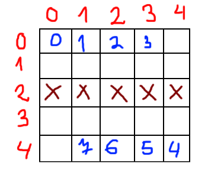

#### _Telerik Academy Season 2016-2017 / JavaScript Fundamentals Exam - 04 June 2016_

# Task 2: Game of Tanks

## Description
Do you know why Koceto and Cuki always miss the deadlines for their tasks? That's because instead of working on their tasks, they play a console game in the office - **Tanks**. 
The game is relatively simple - it is played on a field with **R** rows and **C** columns. The rows and columns are **zero-based** and are counted from the upper left corner - meaning that the upper leftmost cell has coordinates (0, 0). 
Each players has 4 **tanks** - Koceto's tanks are **0-3**, Cuki's are **4-7**. Koceto's tanks start at row **0** on columns: **0 at 0**, **1 at 1**, **2 at 2**, **3 at 3**. Cuki's start at row **R - 1**: **4 at C - 1**, **5 at C - 2**, **6 at C - 3**, **7 at C - 4**. 
Each tank can move **up**, **down**, **left** and **right** by **n** cells. There is debris in some cells - tanks cannot move through debris. Tanks can also shoot **up**, **down**, **left** or **right**. A tank shot starts from the place of the tanks and travels in a straight line 
until it hits something(debris or another tank) or goes out of the field. If the tank shot hits something, it is destroyed - **hit debris is removed** and the cell becomes passable, while **hit tanks are removed from play**. The game ends when either Koceto or Cuki lose all their tanks. Simulate a game of tanks by a given sequence of commands. The commands are in the following format:

- "**mv id n dir**"
  - Moves the tank with number **id** **n** cells in the direction **dir**.
  - If tank encounters debris, a field border or another tank in the direction it's moving, it stops moving.
- "**x id dir**"
  - The tank with number **id** shoots in the direction **dir**.
  - Anything hit by a shot is destroyed.

## Input
- The first element of the input will be a string containing the integers **R** and **C** separated by a whitespace - the amount of rows and columns of the field.
- The second element will be a string containing pairs of coordinates, each pair separated from the other pairs by the symbol **;**. The coordinates in each 
pair will be in the format **R** **C** - the row coordinate, followed by a whitespace, followed by the column coordinate.
  - Example: **3 4;5 6;20 30**
  - These are the coordinates of the cells that contain debris.
- The third element will be an integer **N** - the number of commands.
- The next **N** elements will be string commands in the format described above.

## Output
- When a tank is destroyed, print **Tank id is gg**, where **id** is the number of the destroyed tank.
- When the game ends, print the following **losername is gg**, where **loser-name** is either **Koceto** or **Cuki**, depending on who lost the game.

## Constraints
- **C** will always be a valid in integer in the range **[5, 50]**.
- **R** will always be a valid in integer in the range **[2, 50)**.
- **0** < **N** < **200**.
- **id** will always be a valid tank number. **n** will be a positive integer. **dir** will be one of the for allowed directions - **u**, **d**, **l**, **r**.
- There will never be debris at the starting positions of the tanks.
- Time limit: **0.3s**
- Memory limit: **24MB**

## Sample Tests

### Input 1
```js
[
    '5 5',
    '2 0;2 1;2 2;2 3;2 4',
    '13',
    'mv 7 2 l',
    'x 7 u',
    'x 0 d',
    'x 6 u',
    'x 5 u',
    'x 2 d',
    'x 3 d',
    'mv 4 1 u',
    'mv 4 4 l',
    'mv 1 1 l',
    'x 4 u',
    'mv 4 2 r',
    'x 2 d'
]
```

- Before the start of this game, the field should look like that:
  - The red numbers are the indeces of the rows/columns.
  - The blue numbers are represent the tanks.
  - The red-brown crosses represent the debris.



### Output 1
```
Tank 7 is gg
Tank 6 is gg
Tank 5 is gg
Tank 0 is gg
Tank 4 is gg
Cuki is gg
```

### Input 2
```js
[
    '10 10',
    '1 0;1 1;1 2;1 3;1 4;4 1;4 2;4 3;4 4',
    '8',
    'mv 4 9 u',
    'x 4 l',
    'x 4 l',
    'x 4 l',
    'x 0 r',
    'mv 0 9 r',
    'mv 5 1 r',
    'x 5 u'
]
```

### Output2
```
Tank 3 is gg
Tank 2 is gg
Tank 1 is gg
Tank 4 is gg
Tank 0 is gg
Koceto is gg
```

### Input 3
```js
[
    '10 5',
    '1 0;1 1;1 2;1 3;1 4;3 1;3 3;4 0;4 2;4 4',
    '43',
    'mv 6 5 r',
    'mv 0 6 d',
    'x 0 d',
    'x 0 d',
    'x 6 u',
    'x 6 u',
    'x 6 u',
    'x 6 u',
    'x 6 u',
    'x 7 u',
    'x 7 u',
    'x 7 u',
    'x 7 u',
    'x 7 u',
    'x 3 d',
    'x 3 d',
    'x 3 d',
    'x 3 d',
    'x 3 d',
    'x 4 u',
    'x 4 u',
    'x 4 u',
    'x 4 u',
    'x 4 u',
    'x 0 r',
    'mv 0 6 d',
    'mv 0 9 r',
    'x 0 d',
    'mv 0 1 l',
    'x 0 d',
    'mv 0 1 l',
    'x 0 d',
    'mv 0 1 l',
    'x 0 d',
    'mv 0 1 l',
    'x 0 d',
    'mv 0 1 l',
    'x 0 d',
    'mv 0 1 l',
    'x 0 d',
    'mv 0 1 l',
    'x 0 d',
    'mv 0 1 l',
    'x 0 d'
]
```

### Output 3
```
Tank 2 is gg
Tank 1 is gg
Tank 5 is gg
Tank 3 is gg
Tank 4 is gg
Tank 6 is gg
Tank 7 is gg
Cuki is gg
```
