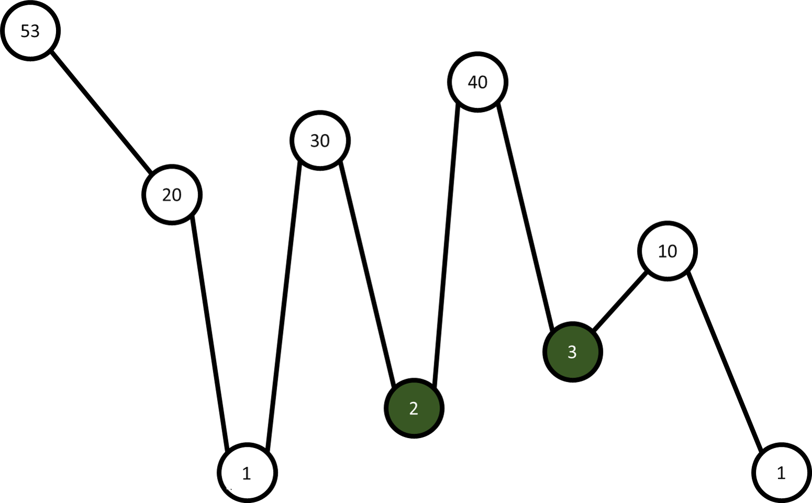

#### _Telerik Academy Season 2016-2017 / JavaScript Fundamentals Exam - 05 June 2016_

# Pockets

## Description

The earth is not flat. You are given a sequence of numbers representing heights. A **peak** is a height, that is **larger than its direct neighbours and has exactly two of them**. A **valley** is a sequence of 3 or more heights **between two peaks**, including the peaks.

A **pocket** is a valley that:
-   Has immediate neighbours (**N1** and **N2**)) which are peaks



-   Pockets are in green

Your task is to write a program which finds the **sum of all pockets** in a valley.

## Input
- Input will consist of an array with single element: the heights with a space between them
- _The input will always be valid and in the described format. There is no need to validate it explicitly._

## Output
- Output should consist of a single line: the **sum of all pockets**

## Constraints
-   The number of heights will always be less than `10000`
-   Each height will be between `0` and `50`
-   **Time limit: 0.3 s**
-   **Memory limit: 16 MB**

##  Solution template

-   Follow the exact template:

```js
function solve(args){
    let heights = args[0]...

    let result;

    //your solution here

    console.log(result);
}
```

## Sample tests

### Sample Test 1

#### Input
```js
[
    "53 20 1 30 2 40 3 10 1"
]
```

#### Output
```
5
```

### Sample Test 2

#### Input
```js
[
	"53 20 1 30 30 2 40 3 10 1"
]
```

#### Output
```
3
```

### Sample Test 3

#### Input
```js
[
	"53 20 1 30 2 40 3 3 10 1"
]
```

#### Output
```
2
```
