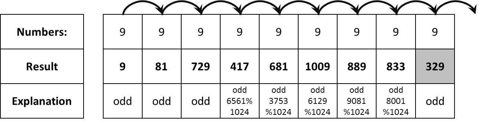

# Coki Skoki

## Description

Coki is a rabbit. Like all rabbits he likes to jump around, but unlike all rabbits that is all he does. That's why he is more famous as Skoki.

While jumping, Skoki likes to think and make games with jumps. His latest game is about numbers. He jumps on the numbers following the rules:

- He enters on the first number
- If the number is odd:
  - He multiplies the current result by this number
  - Then he jumps on the closest number on the right
- If the number is even:
  - He adds this number to the current result
  - Then he jumps over (skips) the closest number on the right and lands on the next

Since Skoki is jumpy, but not that bright and he can use only small numbers, after each jump, the current result must be simplified by module 2<sup>10</sup>

## Examples

- _Exampel 1:_


- _Exampel 1:_



## Input
- As the first input element, you will receive the number `N`, the number of numbers in the sequence
- The next `N` elements will be numbers

## Output

- You should output a single number, the result of the jumps

## Constraints
- `N` will always be between `3` and `10000`
- Each of the numbers will be between `0` and `1024`

## Sample tests

### Sample test 1

#### Input

```js
[
  '10',
  '1',
  '2',
  '3',
  '4',
  '5',
  '6',
  '7',
  '8',
  '9',
  '0'
]
```

#### Output

```js
21
```

### Sample test 2


#### Input

```js
[
  '9',
  '9',
  '9',
  '9',
  '9',
  '9',
  '9',
  '9',
  '9',
  '9'
]
```

#### Output

```js
329
```
