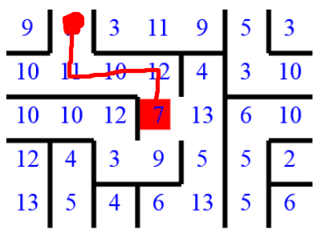

# Lost

## Description
You are **LOST**! You were on your way to the **JavaScript Fundamentals Exam** when suddenly a wild **banda** consisting of **zdravi batki** kidnapped you. 
They put you in the center of a **maze** (a labyrinth, not a cellar full of **wine**, **turshiya** and **rakiya**). The **batki** will chase you and you'll have to escape from the **maze** and from them.


The **maze** has **R** rows and **C** columns. You always start from the cell in the middle of the **maze** (**R** and **C** will always be odd integer numbers). 
From any cell, you will always first try to go **up**, if you cannot go up, try to go **right**, if you cannot go right, try to go **down**, if you cannot go down, try going **left**. 
If you cannot go left, that means you cannot go anywhere - the **batki** will catch you and have you brew bottles of **rakiya** for them - then you won't be able to go to the **JavaScript Fundamentals Exam** in time. 
You should stop running and print **`No JavaScript, only rakiya ROW COLUMN`**, where **ROW** is the row number where you're stuck and **COLUMN** is the column where you're stuck.

**You can only move to an adjacent cell if there is no wall between your current cell and the destination cell and you haven't visited the destination cell before.**
If a step puts you out of the **maze**, you escape the **batki** and should print **`No rakiya, only JavaScript ROW COLUMN`** where **ROW** is the row number of the cell you escaped from and **COLUMN** is the number of the column of the cell you escaped from.

### Where can you go from each cell?
Each cell will contain an integer number in the range [0..15] inclusive. The bits of the number represent whether you can move in a given direction. 
If a bit at a position is **1**, you can move in that direction. Below are the positions and their respective directions.

| Position | Direction | Explanation                                                 |
|:-------- |:--------- |:----------------------------------------------------------- |
| 0        | up        | If the bit at the position is **1**, you can move **up**    |
| 1        | right     | If the bit at the position is **1**, you can move **right** |
| 2        | down      | If the bit at the position is **1**, you can move **down**  |
| 3        | left      | If the bit at the position is **1**, you can move **left**  |

#### Examples

| Cell value | Binary representation | Possible directions |
|:---------- | ---------------------:|:------------------- |
| 1          | 0001                  | only up             |
| 7          | 0111                  | up, right and down  |
| 10         | 1010                  | right and left      |
| 15         | 1111                  | all directions      |

## Input
- As the first input element, you will receive the number **R** and **C**, separated by a space - the dimensions of the **maze**.
- The next **R** elements will be the rows of the **maze** - you will receive numbers separated by a space. Each number represents a cell.
- See the sample tests for more details.

## Output
- You should output a single line as described above. Both `console.log` and `return` are a valid way of outputting.
- See the sample tests for more details.

## Constraints
- 5 <= **R** <= 90
- 5 <= **C** <= 90
- **R** and **C** will always be odd numbers
- All numbers - **R**, **C** and all cell values will always be integer values.
- The cells will never contain numbers larger than 15 or lesser than 1.
- The input will **always** be valid and in the described format. There is no need for you to check it explicitly.
- You cannot visit the same cell twice (see sample test #2).

## Sample tests

### Sample test 1

#### Input
```
[
	'5 7',
	'9 5 3 11 9 5 3',
	'10 11 10 12 4 3 10',
	'10 10 12 7 13 6 10',
	'12 4 3 9 5 5 2',
	'13 5 4 6 13 5 6'
]
```

#### Output
```
No rakiya, only JavaScript 0 1
```



### Sample test 2

#### Input
```
[
	'7 5',
	'9 3 11 9 3',
	'10 12 4 6 10',
	'12 3 13 1 6',
	'9 6 11 12 3',
	'10 9 6 13 6',
	'10 12 5 5 3',
	'12 5 5 5 6'
]
```

#### Output
```
No JavaScript, only rakiya 1 2
```


