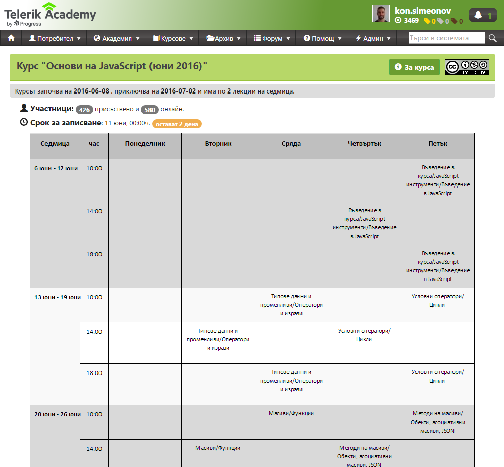

<!-- section start -->
<!-- attr: {  class:'slide-title', showInPresentation:true, hasScriptWrapper:true, style:'font-size: 0.9em' } -->
# JavaScript Fundamentals: Course Introduction
## JS Course Program, Evaluation, Exams, Resources

<!--  -->

	
Javascript Fundamentals

	
Telerik Software Academy

	<a href="https://telerikacademy.com" class="signature-link">https://telerikacademy.com</a>

<!-- section start -->
<!-- attr: { showInPresentation:true, hasScriptWrapper:true } -->
# Table of Contents
- [What's Coming Next in the Academy?](#whats-next)
- [The JavaScript Course Curriculum](#curriculum)
- [Exams and Evaluation](#exam-and-evaluation)
- [Resources for the Course](#resources)
- [Required software](#required-software)

<!--  -->

<!-- section start -->
<!-- attr: { class:'slide-section', showInPresentation:true, hasScriptWrapper:true } -->
<!-- # JavaScript Fundamentals
## Coming To The Next Module -->

<!--  -->

<!-- attr: { id:'whats-next', showInPresentation:true, hasScriptWrapper:true } -->
# What's Coming Next?
- JavaScript Fundamentals
  - Continuation of CSS Styling and HTML Fundamentals
  - Fundamentals of JavaScript
- Pretty much the same
  - Lectures 2 times a week 
  - Practical exam after ~1 month
- The course exam?
  - 3 problems for 4 hours
  - http://bgcoder.com

<!--  -->

<!-- section start -->
<!-- attr: {  class:'slide-section', showInPresentation:true, hasScriptWrapper:true, style:'font-size: 0.8em' } -->
<!-- # JavaScript Fundamentals Curriculum
## What will be covered in the course? -->

<!--  -->

<!-- attr: { id:'curriculum', showInPresentation:true, hasScriptWrapper:true } -->
# Curriculum
- **Course Intro**
  - Curriculum, Exams, Evaluation
- **Introduction to JavaScript development**
  - DHTML, JavaScript history, usage, syntax, helper objects (console, document), dev tools
- **Data types and variables**
  - Data types, numeric types, strings, dates

<!-- attr: { showInPresentation:true, hasScriptWrapper:true } -->
<!-- # Curriculum -->
- **Loops**
  - Loops in JavaScript, for loop, while loop,do-while loop, for-in loop, for-of loop
- **Operators and Expressions**
  - Bitwise operators, logical operators, boolean operators, expressions
- **Conditional statements**
  - if, if-else, switch-case statements

<!-- attr: { showInPresentation:true, hasScriptWrapper:true, style:'font-size: 0.9em' } -->
<!-- # Curriculum -->
- **Functions**
  - Functions in JavaScript, the `arguments` function object
  - Lambda expressions
- **Arrays**
  - Arrays, Array object, constructor, one-dimensional and multi-dimensional arrays
  - Manipulation of Arrays
    - add, remove, find elements
    - copy or delete parts of the array

<!-- attr: { showInPresentation:true, hasScriptWrapper:true, style:'font-size: 0.9em' } -->
<!-- # Curriculum -->
- **Using objects**
  - Creating objects, using objects, `JSON`
  - Associative arrays (maps)
- **Strings**
  - Manipulation of strings
  - String methods
- **Exam preparation**
  - Solving problems with JavaScript
- **Practical Exam**

<!-- section start -->
<!-- attr: { class:'slide-section', showInPresentation:true, hasScriptWrapper:true } -->
<!-- # Evaluation 
## Thank God There Are... No Bonuses! -->

<!--  -->

<!-- attr: { id:'exam-and-evaluation', showInPresentation:true, hasScriptWrapper:true } -->
# Javascript Fundamentals – Evaluation
- Evaluation components
  - **Practical exam** – 80%
  - **Homework** assignments – 15%
  - **Attendance** in class – 5%

<!-- attr: { showInPresentation: true, hasScriptWrapper: true} -->
# Pass / Excellence / Fail Criteria
- Criteria for pass / pass with excellence / fail
  - **Pass with excellence**
    - Very high exam results
    - or High total results
  - **Pass**
    - Average total results
  - **Fail**
    - Low total results or low exam results

<!--  -->
<!--  -->
<!--  -->

<!-- attr: { showInPresentation: true} -->
# The Judge System at the Exam

- All exams will be **tested automatically**
  - Through our online judge system (BG Coder)
  - During the exam preparation you will practice how to use the automated judge system
  - You can log in at any time to practice
- How the testing (judge) system works?
  - You submit your Javascript source code
  - It tests your solution against predefined **tests**
  - For each test passed you get some score

<!-- attr: { showInPresentation: true, style: 'font-size: 40px'} -->
# Homework Assignments

- Doing your homework is very important!
  - Programming can only be learned through **a lot of practice**!
- Homework assignments due 1 week after each lecture – no excuses for being late
  - Deadlines are final & enforced by the system
- Submit all your homework in our **judge system**
  - [bgcoder.com](http://bgcoder.com)
  - You will get real-time feedback for all the tasks

<!-- section start -->
<!-- attr: { class:'slide-section', showInPresentation:true, hasScriptWrapper:true, style:'font-size: 0.9em' } -->
<!-- # Javascript Resources
## What do we need in addition to the course content? -->

<!-- attr: { id:'resources', showInPresentation:true, hasScriptWrapper:true } -->
# JavaScript Resources
- Mozilla Development Network (MDN)
  - https://developer.mozilla.org 
  - Mostly used for the presentations
- Web Platform
  - http://www.webplatform.org
  - The place where all masters contribute
  - Adobe, Apple, Facebook, Google, HP, Intel, Microsoft, Mozilla, Nokia, Opera, W3C

<!-- attr: { showInPresentation:true, hasScriptWrapper:true } -->
# Course Web Site & Forums
- Register for the [Telerik Academy Forums](https://telerikacademy.com/Forum/Category/25/javascript-part-1):
  - Discuss the course exercises/homework with your colleagues
  - Find solutions for the exercises
  - Share source code / discuss ideas

<!-- attr: { showInPresentation:true, hasScriptWrapper:true } -->
<!-- # Course Web Site & Forums -->
- The [Telerik Integrated Learning System](https://telerikacademy.com) (TILS)
  - Important resources for all students
    - Videos, demos, slides, homework assignments
  - Verify your attendance with the presence cards
  - Reports about your results
- [Course page](https://telerikacademy.com/Courses/Courses/Details/339)

<!--  -->

<!-- attr: { id:'required-software', showInPresentation:true, hasScriptWrapper:true } -->
# Required Software
- Software needed for this course:
  - A web browser - Chrome, Opera, Safari, Firefox
  - [Sublime Text 2/3](https://www.sublimetext.com/)
  - [Atom](https://atom.io/)
  - [Visual Studio Code](https://code.visualstudio.com/)
  - [Jetbrains WebStorm](https://www.jetbrains.com/webstorm/)
  - [Visual Studio 2015](https://www.visualstudio.com/en-us/downloads/download-visual-studio-vs.aspx)

<!-- section start -->
<!-- attr: { class:'slide-section', showInPresentation:true, hasScriptWrapper:true, style:'font-size: 0.9em' } -->
<!-- # JavaScript Fundamentals Introduction
## Questions? -->

<!-- attr: { showInPresentation: true, hasScriptWrapper: true, style:'font-size: 0.9em' } -->
# Free Trainings @ Telerik Academy
- "Web Design with HTML 5, CSS 3 and JavaScript" course @ Telerik Academy
    - [javascript course](http://academy.telerik.com/student-courses/web-design-and-ui/javascript-fundamentals/about)
  - Telerik Software Academy
    - [academy.telerik.com](academy.telerik.com)
  - Telerik Academy @ Facebook
    - [facebook.com/TelerikAcademy](facebook.com/TelerikAcademy)
  - Telerik Software Academy Forums
    - [forums.academy.telerik.com](http://telerikacademy.com/Forum/Home)

<!--  -->
<!--  -->
