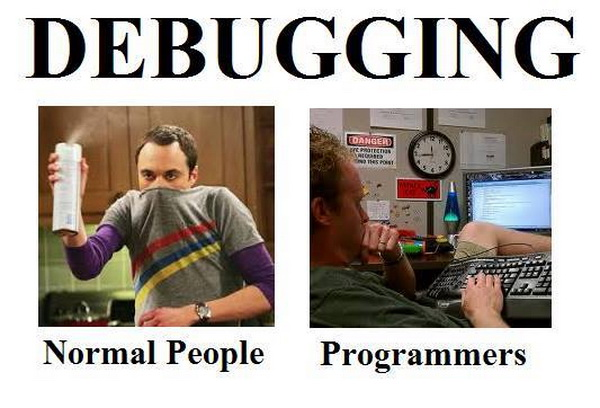

<!-- section start -->
<!-- attr: { class:'slide-title', showInPresentation:true, hasScriptWrapper:true } -->
# JavaScript Development Tools
## Know your Tools!

	
Javascript Fundamentals

	
Telerik Software Academy

	<a href="https://telerikacademy.com" class="signature-link">https://telerikacademy.com</a>

<!--  -->

<!-- section start -->
# Table of Contents
- [JavaScript Coding Tools](#coding-tools)
  - [Editors and IDEs](#coding-tools)
- [Debugging tools](#debugging)
  - [Google Chrome / Opera Developer Tools](#debugging-tools)
  - [Firefox Firebug](#debugging-tools)
  - [Internet Explorer F12](#debugging-tools)
- [Utilities](#utilities)
  - [Linters, playgrounds and other](#utilities-list)

<!-- section start -->
<!-- attr: { class:'slide-section', showInPresentation:true, hasScriptWrapper:true } -->
<!-- # JavaScript Tools
## Know your Tools! -->

<!--  -->

# JavaScript Tools
- JavaScript is an interpreted language
  - It can be ran on the browser or locally
  - The means to acquire the JavaScript code are trivial
    - No matter how or where it is coded
    - You can even code it in Notepad
- Yet, there are many tools that make JavaScript coding eaiser
  - Like editors, debuggers, etc…

<!-- attr: { class:'slide-section', showInPresentation:true, hasScriptWrapper:true } -->
<!-- # JavaScript Coding Tools
## Coding JavaScript made easy! -->

<!--  -->
<!--  -->

<!-- attr: { id:'coding-tools', style:'font-size: 0.9em' } -->
# JavaScript Coding Tools
- All a developer needs for writing Javascript is a text editor - could be even Notepad/Notepad++
- Yet, there are a lot of better options
  - **Text editors with plugins**
    - Atom
    - VS Code
    - Sublime
    - Brackets
  - **IDEs**
    - Visual Studio with Web Essentials
    - Jetbrains Webstorm
    - Eclipse with Javascript plugins

<!-- attr: { hasScriptWrapper: true, style:'font-size: 0.9em' } -->
# Atom
- [Atom](https://atom.io/) is a popular text editor with **large community**
- **Cross-platform** - runs on Windows, Linux and OS X
- **Free, open-source**
- Highly **customizable**
  - Can be customized to provide an integrated terminal
- Provides **file system browser**
- **Lots of plugins and extensions**
  - And a lot of good Javascript plugins

<!--  -->

<!-- attr: { hasScriptWrapper: true, style:'font-size: 0.9em' } -->
# VS Code
- [VS Code](https://code.visualstudio.com/) is an open-source text editor from Microsoft
- **Cross-platform** - runs on Windows, Linux, OS X
- **Customizable**
- Provides features like **file system browser**, **integrated terminal**, **task runners**
- Provides **Javascript debugging** under NodeJS out-of-the-box
- Provides **a lot of plugins and extensions**

<!--  -->

<!-- attr: { hasScriptWrapper: true, style:'font-size: 0.9em' } -->
# Sublime Text
- [Sublime Text](https://www.sublimetext.com/) - popular **cross-platform editor**
- **Proprietary**, unregistered version is free
- **Customizable**
- Rich amount of **plugins and extensions**
- **Good speed performance**

<!--  -->

<!-- attr: { hasScriptWrapper: true } -->
# Visual Studio
- [Visual Studio](https://www.visualstudio.com/) is the main development tool for creating applications with the .NET framework
  - ASP.NET, WPF, etc
- The [Web Essentials](http://vswebessentials.com/) extensions mix in a lot of **powerful javascript tools**
  - Intellisense, autocomplete, user snippets and more
- **Powerful, but heavy**

<!--  -->

<!-- attr: { hasScriptWrapper: true, style:'font-size: 0.9em' } -->
# Jetbrains WebStorm
- [Jetbrains WebStorm](https://www.jetbrains.com/webstorm/) is a ready-to-use IDE for JavaScript development
  - Including web development with HTML and CSS
- **WebStorm has most of the necessary features for web development**
  - Code highlighting, code completion
  - Javascript debugging and intellisense
- **WebStorm is a paid software**
  - Yet, **Jetbrains offer a discount (100%) for students**

<!--  -->

<!-- attr: { id:'debugging', class:'slide-section', showInPresentation: true, hasScriptWrapper: true } -->
<!-- # Debugging Javascript -->

<!--  -->

<!-- attr: { id:'debugging-tools' } -->
# Debugging JavaScript
- Sadly, no intelligent way of debugging client-side JavaScript
  - The only way to debug client-side JavaScript is through the browser
  - Server-side JS can be debugged in several ways
- Fortunately all browsers have their own debugging tool/plugin that makes it easier
  - Firefox has **Firebug**
  - Chrome and Opera have **Web developer**
  - Internet Explorer has **F12**

<!-- attr: { id:'utilities', class:'slide-section', showInPresentation: true, hasScriptWrapper: true } -->
<!-- # Javascript Utilities -->

<!--  -->

<!-- attr: { id:'utilities-list' } -->
# JavaScript Utilities
- JavaScript Code Quality Tools
  - http://www.jshint.com/
  - http://www.jslint.com/
- HTML, CSS and JavaScript playgrounds
  - http://jsbin.com 
  - http://liveweave.com
  - https://jsfiddle.net/
- JavaScript performance tester
  - http://jsperf.com

<!-- attr: { class:'slide-section', showInPresentation: true } -->
<!-- # JavaScript Tools
## Questions? -->

<!-- attr: { showInPresentation: true, hasScriptWrapper: true, style:'font-size: 0.9em' } -->
# Free Trainings @ Telerik Academy
- "Web Design with HTML 5, CSS 3 and JavaScript" course @ Telerik Academy
    - [javascript course](http://academy.telerik.com/student-courses/web-design-and-ui/javascript-fundamentals/about)
  - Telerik Software Academy
    - [academy.telerik.com](academy.telerik.com)
  - Telerik Academy @ Facebook
    - [facebook.com/TelerikAcademy](facebook.com/TelerikAcademy)
  - Telerik Software Academy Forums
    - [forums.academy.telerik.com](http://telerikacademy.com/Forum/Home)

<!--  -->
<!--  -->
<!--  -->