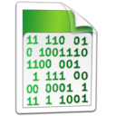
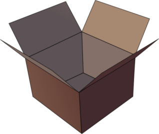
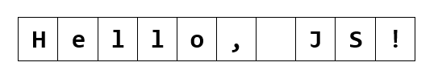
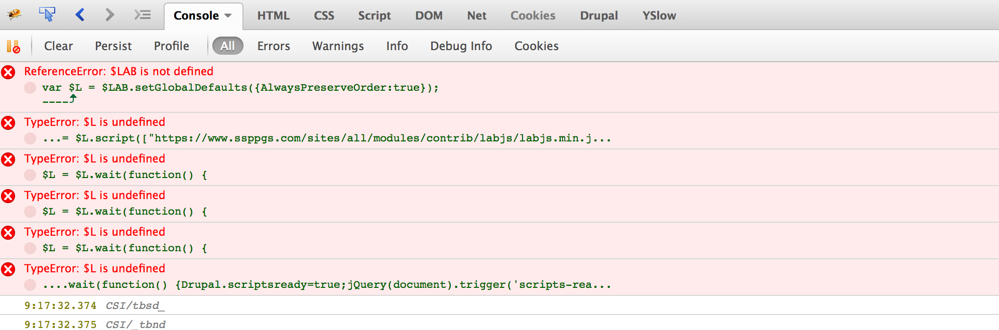
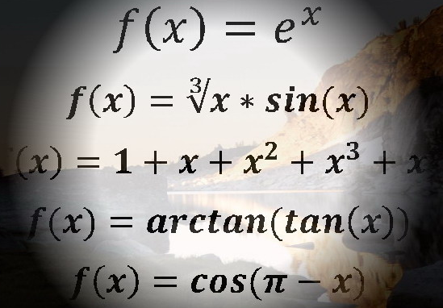
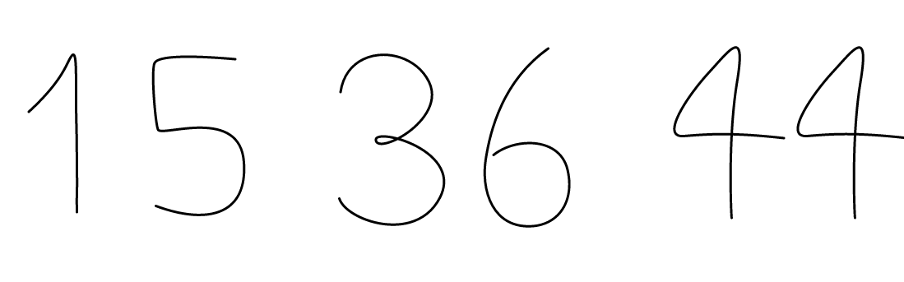
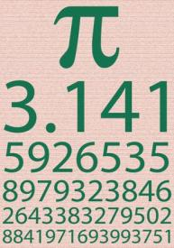

<!-- section start -->
# Data Types and Variables
<!--  -->
<!--  -->
<!--  -->
<!--  -->
<div class="signature">
	<p class="signature-course"></p>
	<p class="signature-initiative"></p>
	<a href="https://telerikacademy.com/" class="signature-link"></a>
</div>


<!-- section start -->
# Table of Contents
- Data Types
  - Integer
  - Floating-Point
  - Boolean
  - String
- Declaring and Using Variables
  - Identifiers
  - Declaring Variables and Assigning Values
<!--  -->


<!-- section start -->
# Data Types in JavaScript
<!--  -->
<!--  -->


# How Computing Works?
- Computers are machines that process data
  - Data is stored in the computer memory in **variables**
  - Variables have **name**, **data type**and **value**
- _Example_ of variable definition and assignment in JavaScript:

```js
var count = 5;
```

<div class="fragment balloon" style="top:53.96%; left:41.14%; width:38.79%">Variable name</div>
<div class="fragment balloon" style="top:74.53%; left:39.67%; width:35.26%">Variable value</div>


# What Is a Data Type?
- A **data type**:
  - Is a domain of values of similar characteristics
  - Defines the type of information stored in the computer memory (in a variable)
- _Example_s:
  - Positive integers: **1**, **2**, **3**, **…**
  - Alphabetical characters: **a**, **b**, **c**, **…**
<!--  -->


# JavaScript Data Types
- JavaScript is actually **typeless** language
  - i.e. the type of a variable can be changed
  - All variables are declared with the keyword **var**

```js
var count = 5; // variable holds an integer value
count = 'hello'; // the same variable now holds a string
var name = 'Teleirk Academy'; // variable holds a string
var mark = 5.25 // mark holds a floating-point number
```


<!-- section start -->
# Introducing Variables
<!--  -->
<!--  -->


# What Is a Variable?
- A **variable** is a:
  - Placeholder of information that can usually be changed at run-time
  - A piece of computer memoryholding some value
- Variables allow you to:
  - Store information
  - Retrieve the stored information
  - Manipulate the stored information
<!--  -->


# Variable Characteristics
- A variable has:
  - Name
  - Type (of stored data)
  - Value
- _Example_:
  - Name: **counter**
  - Type: **integer**
  - Value: **5**

```js
var counter = 5;
```

<!--  -->


<!-- section start -->
# Integer Types
<!--  -->


# What are Integer Types?
- Integer types:
  - Represent whole numbers
  - Have range of values, depending on the size of memory used
<!--  -->


# Integer Types – _Example_
- **Integer** type can hold numbers from **-****9007199254740992** to **9007199254740992**
  - The underlying type behind is a floating-point number (IEEE-754)

```js
var studentsCount = 5;
var maxInteger = 9007199254740992;
var minInteger = -9007199254740992;
var a = 5, b = 3;
var sum = a + b; // 8
var div = a / 0; // Infinity
```


# Integer Types
## [Demo]()
<!--  -->


<!-- section start -->
# Floating-Point Numbers
<!--  -->


# What are Floating-Point Types?
- Floating-point types:
  - Represent real numbers
  - Have range of values and precision
  - Can behave abnormally in the calculations
<!--  -->


# Floating-Point Types
- Floating-point size depend on the platform
  - The browser and the OS
- 32-bit OS and browser have 32 bits for number, while 64-bit have 64 bits
  - It is good idea to use up to 32-bit numbers
    - Will always work on all platforms


# Floating-Point Types – _Example_
- The **floating-point**type can hold numbers from **5e-324** to **1.79e+308**

```js
var PI = Math.PI; // 3.141592653589793
var minValue = Number.MIN_VALUE; // 5e-324
var maxValue = Number.MAX_VALUE; // 1.79e+308
var div0 = PI / 0; // Infinity
var divMinus0 = -PI / 0; // -Infinity
var unknown = div0 / divMinus0; // NaN
```


# Abnormalities in the Floating-Point Calculations
- Sometimes abnormalities can be observed when using floating-point numbers
  - Comparing floating-point numbers can not be performed directly with the **equals**operators (== and ===)
- _Example_:

```js
var a = 0.1;
var b = 0.2;
var sum = 0.3;
var equal = (a+b == sum); // false!!!
console.log('a+b = '+ (a+b) + ', sum = ' +
  sum + ', sum == a+b? is ' + equal);
```

<!--  -->


# Floating-Point Types
## [Demo]()
<!--  -->


# Numbers in JavaScript
- All numbers in JavaScript are stored internally as double-precision floating-point numbers
  - According to the IEEE-754 standard
  - Can be wrapped as objects of type Number
- _Example_:

```js
var value = 5;
value = 3.14159;
value = new Number(100); // Number { 100 }
value = value + 1; // 101
var biggestNum = Number.MAX_VALUE;
```


# Numbers Conversion
- Convert **floating-point**to **integer** number
- Convert to **integer** number with rounding
- Convert**string**to **integer**

```js
var valueDouble = 8.75;
var valueInt = valueDouble | 0; // 8
```


```js
var valueDouble = 8.75;
var roundedInt = (valueDouble + 0.5) | 0; // 9
```


```js
var str = '1234';
var i = str | 0 + 1; // 1235
```


# Number Conversion
## [Demo]()
<!--  -->


<!-- section start -->
# Boolean Type
<!--  -->
<!--  -->


# The Boolean Data Type
- The **Boolean****data type**:
  - Has two possible values:
    - **true** and **false**
  - Is useful in logical expressions
<!--  -->


# Boolean Values – _Example_
- _Example_ of boolean variables taking values of **true** or **false**:

```js
var a = 1;
var b = 2;
var greaterAB = (a > b);
console.log(greaterAB);  // false
var equalA1 = (a == 1);
console.log(equalA1);    // true
```


# Boolean Type
## [Demo]()
<!--  -->


<!-- section start -->
# String Type
<!--  -->
<!--  -->


# The String Data Type
- The **string data type**:
  - Represents a sequence of characters
- Strings are enclosed in quotes:
  - Both **'** and **"** work correctly
    - Best practices suggest using single quotes
- Strings can be concatenated
  - Using the **+** operator

```js
var s = 'Welcome to JavaScript';
```


```js
var name = 'Ivaylo' + ' ' + 'Kenov';
```


# Saying Hello – _Example_
- Concatenating the two names of a person to obtain his full name:
  - _Note_: a space is missing between the two names! We have to add it manually

```js
var firstName = 'Ivan';
var lastName = 'Ivanov';
console.log('Hello, ' + firstName + '!');

var fullName = firstName + ' ' + lastName;
console.log('Your full name is ' + fullName);
```


# Strings are Unicode
- Strings are stored as Unicode
  - Unicode supports all commonly used alphabets in the world
    - E.g. Cyrillic, Chinese, Arabic, Greek, etc. scripts

```js
var asSalamuAlaykum = 'السلام عليكم';
alert(asSalamuAlaykum);
var кирилица = 'Това е на кирилица!';
alert(кирилица);
var leafJapanese = '葉';
alert(leafJapanese);
```


# String Data Type
## [Demo]()
<!--  -->
<!--  -->


# Parsing String to Numbers
- Strings can be parsed to numbers
  - Floating-point and rounded (integer)
- The trivial way to parse string to a number is using the functions **parseInt****()** and **parseFloat****()**:

```js
var numberString = '123'
console.log(parseInt(numberString); //prints 123
var floatString = '12.3';
console.log(parseFloat(floatString); //prints 12.3
```

  - Yet a strange behavior is supported:
    - If a non-number string starts with a number, only the number is extracted:

```js
var str = '123Hello';
console.log(parseInt(str)); //prints 123
```


# Better String to Number Parsing
- **parseInt****()** and **parseFloat****()** are great, but slow
  - Better ways to parse string to numbers are as follows:
    - With rounding:
    - As is:

```js
'123.3' | 0 -> returns 123
```


```js
Number('123.3') -> returns 123.3
```


```js
'123.3' * 1 -> returns 123.3
```


```js
+'123.3' -> returns 123.3
```

<div class="fragment balloon" style="top:61.35%; left:68.72%; width:38.79%">Preferred ways</div>
<div class="fragment balloon" style="top:61.35%; left:68.72%; width:38.79%">Preferred ways</div>


<!-- section start -->
# Undefined and Null Values
## Understanding '**undefined**' in JavaScript
<!--  -->
<!--  -->


# Undefined and Null Values
- In JS there is a special value **undefined**
  - It means the variable has not been defined (no such variable in the current context)
- **undefined** is different than **null**
  - **null** means that an object exists and is empty

```js
var x = 5;
x = undefined;
alert(x); // undefined
x = null;
alert(x); // null
```


# Checking a Variable Type
- The variable type can be checked at runtime:

```js
var x = 5;
console.log(typeof(x)); // number
console.log(x); // 5
x = new Number(5);
console.log(typeof(x)); // object
console.log(x); // Number {}
x = null;
console.log(typeof(x)); // object
x = undefined;
console.log(typeof(x)); // undefined
```


# Undefined / Null / Typeof
## [Demo]()
<!--  -->
<!--  -->
<!--  -->


<!-- section start -->
# Declaring and Using Variables
<!--  -->


# Declaring Variables
- When declaring a variable we:
  - Specify its **name** (called identifier)
  - May give it an **initial****value**
  - The **type** is identified by the value
- The syntax is the following:
- _Example_:

```js
var <identifier> [= <initialization>];
```


```js
var height = 200;
```


# Identifiers
- Identifiers may consist of:
  - Letters (Unicode)
  - Digits [**0**-**9**]
  - Underscore '**_**'
  - Dollar '**$**'
- Identifiers
  - Can begin only with a letter, $, or an underscore
  - Cannot be a JavaScript keyword
- Variables / functions names: use **camelCase**
<!--  -->


- Identifiers
  - Should have a descriptive name
  - It is recommended to use only Latin letters
  - Should be neither too long nor too short
- Names in JavaScript are **case-sensitive**
  - Small letters are considered different than the capital letters


# Identifiers – _Example_s
- _Example_s of correct identifiers:
- _Example_s of incorrect identifiers:

```js
var new;	// new is a keyword
var 2Pac;	// Cannot begin with a digit
```


```js
var New = 2; // Here N is capital
var _2Pac; // This identifier begins with _
var поздрав = 'Hello'; // Unicode symbols used
// The following is more appropriate:
var greeting = 'Hello';
var n = 100; // Undescriptive
var numberOfClients = 100; // Descriptive
// Overdescriptive identifier:
var numberOfPrivateClientOfTheFirm = 100;
```


<!-- section start -->
# Assigning Values To Variables
<!--  -->
<!--  -->


# Assigning Values
- Assigning values to variables
  - Is achieved by the **=** operator
- The **=** operator has
  - Variable identifier on the left
  - Value on the right
    - Can be of any value type
  - Could be used in a cascade calling, where assigning is done from right to left
<!--  -->


# Assigning Values – _Example_s
- Assigning values example:

```js
var firstValue = 5;
var secondValue;
var thirdValue;

// Using an already declared variable:
secondValue = firstValue;

// The following cascade calling assigns
// 3 to firstValue and then firstValue
// to thirdValue, so both variables have
// the value 3 as a result:

thirdValue = firstValue = 3; // Avoid this!
```

<!--  -->


# Initializing Variables
- Initializing
  - Is assigning of initial value
  - Must be done before the variable is used!
- Several ways of initializing:
  - By using a literal expression
  - By referring to an already initialized variable
- Uninitialized variables are undefined
<!--  -->


# Initialization – _Example_s
- _Example_ of some initializations:

```js
// This is how we use a literal expression:
var heightInMeters = 1.74;

// Here we use an already initialized variable:
var greeting = 'Hello World!';
var message = greeting;
```


# Assigning and Initializing Variables
## [Demo]()
<!--  -->
<!--  -->


# Local and Global Variables
- Local variables
  - Declared with the keyword **var**
- Global variables
  - Declared **without** the keyword **var**
  - Bad practices – never do this!

```js
var a = 5; // a is local in the current scope
a = 'alabala'; // the same a is referenced here
```


```js
a = undefined;
a = 5; // the same as window.a = 5;
```


# Data Types and Variables
- http://academy.telerik.com


# Free Trainings @ Telerik Academy
- "Web Design with HTML 5, CSS 3 and JavaScript" course @ Telerik Academy
    - html5course.telerik.com
  - Telerik Software Academy
    - academy.telerik.com
  - Telerik Academy @ Facebook
    - facebook.com/TelerikAcademy
  - Telerik Software Academy Forums
    - forums.academy.telerik.com
<!--  -->
<!--  -->
<!--  -->
<!--  -->


