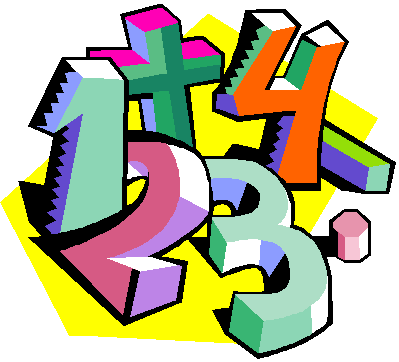
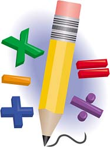
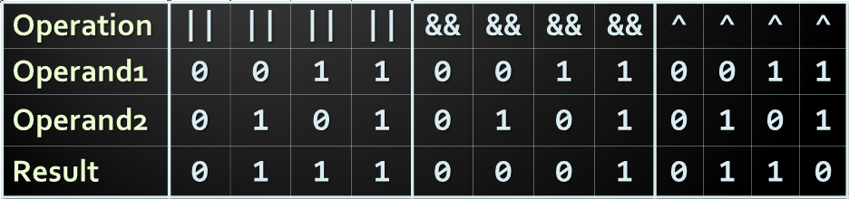
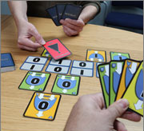
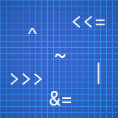
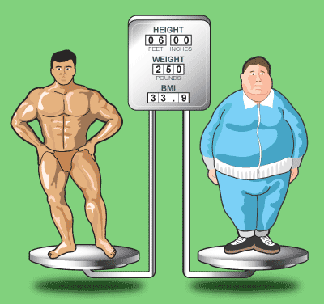

<!-- section start -->
<!-- attr: {  class:'slide-title', hasScriptWrapper:true } -->
# Operators and Expressions
## Performing Simple Calculations with JavaScript

<div class="signature">
	<p class="signature-course">Javascript Fundamentals</p>
	<p class="signature-initiative">Telerik Software Academy</p>
	<a href="https://telerikacademy.com" class="signature-link">https://telerikacademy.com</a>
</div>

<!--  -->

<!-- section start -->
<!-- attr: { hasScriptWrapper: true } -->
# Table of Contents
- [Operators in JavaScript](#operators-in-js)
- [Arithmetic Operators](#arithmetic-operators)
- [Logical Operators](#logical-operators)
- [Bitwise Operators](#bitwise-operators)
- [Comparison Operators](#comparison-operators)
- [Assignment Operators](#assignment-operators)
- [Other Operators](#other-operators)
- [Operator Precedence](#operator-precedence)
- [Expressions](#expressions)

<!--  -->

<!-- section start -->
<!-- attr: { showInPresentation:true, hasScriptWrapper: true, style:'font-size: 0.9em' } -->
<!-- # Operators in JavaScript
## Arithmetic, Logical, Comparison, Assignment, Etc. -->

<!--  -->
<!--  -->

# What is an Operator?
-  An operator is a symbol that represents an **operation performed over data** at runtime
  - Takes **one or more arguments** (operands)
  - Produces a **new value**
- **Operators have precedence** (priority)
  - Precedence defines which will be evaluated first
- Expressions are sequences of operators and operands that are evaluated to a single value

<!-- attr: { id:'operators-in-js', hasScriptWrapper: true } -->
# <a id="operators-in-js"></a>Operators in JavaScript
- Operators in JavaScript :
  - **Unary** – take one operand
  - **Binary** – take two operands
  - **Ternary** (`?:`) – takes three operands
- Except for the assignment operators, all binary operators are left-associative
- The assignment operators and the conditional operator (`?:`) are right-associative

<!--  -->

<!-- attr: { hasScriptWrapper: true, style:'font-size: 0.8em' } -->
# Operators by categories in JavaScript

|        Category      |                                  Operators                              |
|----------------------|-------------------------------------------------------------------------|
| Arithmetic           | `+` `-` `*` `/` `%` `++` `--`                                           |
| Logical              | `&&` <code>&#124;&#124;</code> `^` `!`                                  |
| Binary               | `&` <code>&#124;</code> `^` `~` `<<` `>>` `>>>`                         |
| Comparison           | `==` `!=` `<` `>` `<=` `>=` `===` `!==`                                 |
| Assignment           | `=` `+=` `-=` `*=` `/=` `%=` <code>&#124;=</code> `^=` `<<=` `>>=`      |
| Concatenation        | `+`                                                                     |
| Other                | `.` `[]` `()` `?:` `new` `in` `,` `delete` `void` `typeof` `instanceof` |                       |

<!-- section start -->
<!-- attr: { id:'arithmetic-operators', class:'slide-section', showInPresentation:true, hasScriptWrapper: true } -->
<!-- # <a id="arithmetic-operators"></a>Arithmetic Operators -->

<!--  -->

# Arithmetic Operators
- Arithmetic operators `+`, `-`, `*`, `/` are the same as in math 
- Division operator `/` returns number or  `Infinity` or `NaN`
- Remainder operator `%` returns the remainder from division of numbers
  - Even on real (floating-point) numbers
- The special addition operator `++` increments a variable

<!-- attr: { hasScriptWrapper: true } -->
# Arithmetic Operators – _Example_

```js
let squarePerimeter = 17;
let squareSide = squarePerimeter / 4.25;
let squareArea = squareSide * squareSide;

console.log(squareSide); // 4.25
console.log(squareArea); // 18.0625

let a = 5;
let b = 4;

console.log(a + b); // 9
console.log(a + b++); // 9
console.log(a + b); // 10
console.log(a + (++b)); // 11
console.log(a + b); // 11

console.log(12 / 3); // 4
console.log(11 / 3); // 3.6666666666666665
```

<!-- attr: { hasScriptWrapper: true, showInPresentation: true } -->
<!-- # Arithmetic Operators – _Example_ -->

```js
console.log(11 % 3);   // 2
console.log(11 % -3);  // 2
console.log(-11 % 3);  // -2

console.log(1.5 / 0.0);  // Infinity
console.log(-1.5 / 0.0); // -Infinity
console.log(0.0 / 0.0);  // NaN

let x = 0;
console.log(5 / x);
```

<!-- attr: { class:'slide-section demo', showInPresentation: true, hasScriptWrapper: true } -->
<!-- # Arithmetic Operators
## [Demo]() -->

<!--  -->

<!-- section start -->
<!-- attr: { id:'logical-operators', class:'slide-section', showInPresentation: true, hasScriptWrapper: true } -->
<!-- # <a id="logical-operators"></a>Logical Operators-->

<!--  -->

<!-- attr: { showInPresentation: true, hasScriptWrapper: true, style:'font-size: 0.9em' } -->
# Logical Operators
- Logical operators take boolean operands and return boolean result
- Operator `!` turns `true` to `false` and `false` to `true` 
- Behavior of the operators `&&`, `||` and `^` (`1` == `true`, `0` == `false`) :

<!--  -->

<!-- attr: { showInPresentation: true } -->
<!-- # Logical Operators – _Example_ -->
- Using the logical operators:

```js
let a = true;
let b = false;

console.log(a && b); // False
console.log(a || b); // True
console.log(a ^ b); // True
console.log(!b); // True
console.log(b || true); // True
console.log(b && true); // False
console.log(a || true); // True
console.log(a && true); // True
console.log(!a); // False
console.log((5 > 7) ^ (a == b)); // False
```

<!-- attr: { class:'slide-section demo', showInPresentation: true, hasScriptWrapper: true } -->
<!-- # Logical Operators
## [Demo]() -->

<!--  -->
<!--  -->

<!-- section start -->
<!-- attr: { id:'bitwise-operators', class:'slide-section', showInPresentation: true, hasScriptWrapper: true } -->
<!-- # <a id="bitwise-operators"></a>Bitwise Operators -->

<!--  -->

<!-- attr: { showInPresentation: true, style:'font-size: 0.9em' } -->
# Bitwise Operators
- Bitwise operators are used on integer numbers. They are applied bit by bit.
- Operator `~` turns all `0` to `1` and all `1` to `0`
  - Like `!` for boolean expressions but bit by bit
- The operators `|`, `&` and `^` behave like `||`, `&&` and `^` for boolean expressions but bit by bit
- The `<<` and `>>` shift (move) the bits to the left or to the right

<!-- attr: { showInPresentation: true, hasScriptWrapper: true, style:'font-size: 0.9em' } -->
<!-- # Bitwise Operators - _Examples_: -->

```js
let a = 3;               // 00000000 00000011
let b = 5;               // 00000000 00000101

console.log(a | b);      // 00000000 00000111
console.log(a & b);      // 00000000 00000001
console.log(~a & b);     // 00000000 00000100
console.log(a ^ b);      // 00000000 00000110

console.log(true << 1);  // 00000000 00000010
console.log(true >> 1);  // 00000000 00000000
```

<!-- attr: { class:'slide-section demo', showInPresentation: true, hasScriptWrapper: true } -->
<!-- # Bitwise Operators
## [Demo]() -->

<!-- section start -->
<!-- attr: { id:'comparison-operators', class:'slide-section', showInPresentation: true, hasScriptWrapper: true } -->
<!-- # <a id="comparison-operators"></a>Comparison and Assignment Operators -->

<!--  -->

# Comparison Operators
- Comparison operators are used to compare variables
  - `==`, `<`, `>`, `>=`, `<=`, `!=`,`===`,`!==`
  - For equality comparison, the use of `===` and `!==` is preferred

```js
let a = 5;
let b = 4;

console.log(a >= b);   // True
console.log(a != b);   // True
console.log(a == b);   // False
console.log(0 == '');  // True
console.log(0 === ''); // False
```

<!--  -->

<!-- attr: { id:'assignment-operators' } -->
# <a id="assignment-operators"></a>Assignment Operators
- Assignment operators are used to assign a value to a variable
  - `=`, `+=`, `-=`, `|=`, ...

```js
let x = 6;
let y = 4;

console.log(y *= 2); // 8

let z = y = 3;       // y=3 and z=3  

console.log(z);      // 3
console.log(x |= 1); // 7
console.log(x += 3); // 10
console.log(x /= 2); // 5
```

<!-- attr: { class:'slide-section demo', showInPresentation: true, hasScriptWrapper: true } -->
<!-- # Comparison and Assignment Operators
## [Demo]() -->

<!-- section start -->
<!-- attr: { id:'other-operators', class:'slide-section', showInPresentation: true, hasScriptWrapper: true } -->
<!-- # <a id="other-operators"></a>Other Operators -->

<!--  -->

<!-- attr: { style:'font-size: 0.9em', hasScriptWrapper: true } -->
# Other Operators
- String concatenation operator `+` is used to concatenate strings 
- If the second operand is not a string, it is converted to string automatically

```js
let first = "First";
let second = "Second";

console.log(first + second); // FirstSecond

let output = "The number is : ";
let number = 5;

console.log(output + number); // The number is : 5
```

<!-- attr: { showInPresentation: true, style:'font-size: 0.8em' } -->
<!-- # Other Operators -->
- Member access operator  `.`  is used to access object members
- Square brackets `[]` are used as indexers, to access a member with a certain name
- Parentheses `(` `)` are used to override the default operator precedence or to invoke functions
- Conditional operator `?:` has the form
  - (if `b` is true then the result is `x` else the result is `y`)

```js
b ? x : y
```
- The `new` operator is used to create new objects 
- The `typeof` operator returns the type of the value

<!-- attr: { showInPresentation: true } -->
<!-- # Other Operators – _Example_ -->
- Using some other operators:

```js
let a = 6;
let b = 4;

console.log(a > b ? 'a > b' : 'b >= a'); // a > b

let c = b = 3; // b = 3; followed by c = 3;

console.log(c); // 3
console.log(a instanceof Number); // true
console.log((a + b) / 2); // 4
console.log(typeof c); // number
console.log(void(3 + 4)); // undefined
```

<!-- attr: { class:'slide-section demo', showInPresentation: true, hasScriptWrapper: true } -->
<!-- # Other Operators
## [Demo]() -->

<!-- section start -->
<!-- attr: { id:'operator-precedence', class:'slide-section', showInPresentation: true, hasScriptWrapper: true } -->
<!-- # <a id="operator-precedence"></a>Operators Precedence -->

<!--  -->

# Operators Precedence
- When in doubt, take a look at the [MDN Precedence chart](https://developer.mozilla.org/en-US/docs/Web/JavaScript/Reference/Operators/Operator_Precedence)
- Parenthesis operator always has highest precedence
- _Note_: it's considered a good practice to use parentheses, even when it's not necessary
  - Improves code readability

<!-- section start -->
<!-- attr: { id:'expressions', class:'slide-section demo', showInPresentation: true, hasScriptWrapper: true } -->
<!-- # <a id="expressions"></a>Expressions -->

<!--  -->

<!-- attr: { hasScriptWrapper: true } -->
# Expressions
- Expressions are sequences of operators, literals and variables that are evaluated to some value

```js
let r = (150 - 20) / 2 + 5; // r = 70

// Expression for calculation of circle area
let surface = Math.PI * r * r;

// Expression for calculation of circle perimeter
let perimeter = 2 * Math.PI * r;
```

<!-- attr: { showInPresentation: true, hasScriptWrapper: true } -->
<!-- # Expressions -->

- Expressions have:
  - **Type** (integer, real, boolean, ...)
  - **Value**

```js
let a = 2 + 3; // a = 5

let b = (a + 3) * (a - 4) + (2 * a + 7) / 4;  // b = 12

let greater = (a > b) || ((a == 0) && (b == 0));
```

<!-- attr: { class:'slide-section demo', showInPresentation: true, hasScriptWrapper: true } -->
<!-- # Expressions
## [Demo]() -->

<!--  -->

<!-- section start -->
<!-- attr: { class:'slide-section', showInPresentation: true } -->
<!-- # Operators and Expressions
## Questions? -->

<!-- attr: { showInPresentation: true, hasScriptWrapper: true, style:'font-size: 0.9em' } -->
# Free Trainings @ Telerik Academy
- "Web Design with HTML 5, CSS 3 and JavaScript" course @ Telerik Academy
    - [javascript course](http://academy.telerik.com/student-courses/web-design-and-ui/javascript-fundamentals/about)
  - Telerik Software Academy
    - [academy.telerik.com](academy.telerik.com)
  - Telerik Academy @ Facebook
    - [facebook.com/TelerikAcademy](facebook.com/TelerikAcademy)
  - Telerik Software Academy Forums
    - [forums.academy.telerik.com](http://telerikacademy.com/Forum/Home)

<!--  -->
<!--  -->
