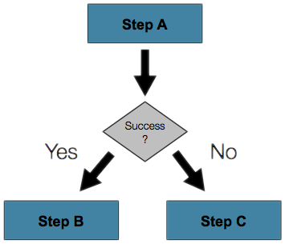
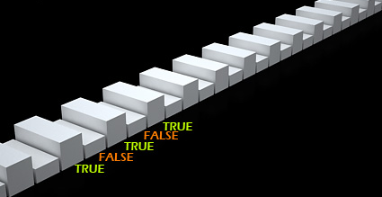
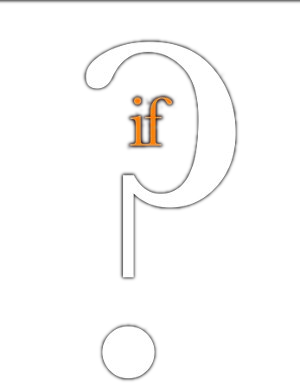
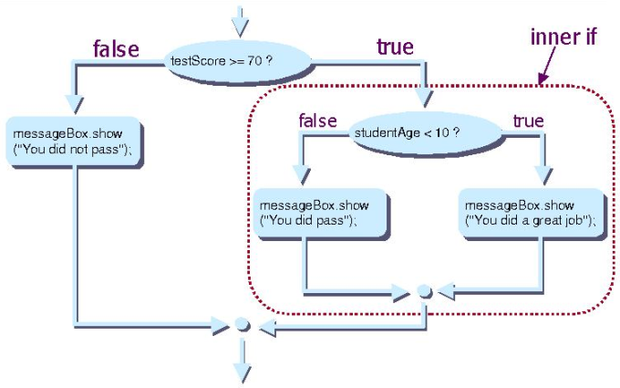

<!-- section start -->
<!-- attr: { hasScriptWrapper:true, class:'slide-section' } -->
# Conditional Statements
## Implementing Control Logic in JavaScript

<!--  -->
<!--  -->
<!--  -->
<!--  -->
<div class="signature">
	<p class="signature-course"></p>
	<p class="signature-initiative"></p>
	<a href="https://telerikacademy.com" class="signature-link"></a>
</div>

<!-- section start -->
<!-- attr: { hasScriptWrapper:true } -->
# Table of Contents
- [The `if` Statement](#if-statement)
- [The `if-else` Statement](#if-else)
- [Nested `if` Statements](#nested-if)
- [The `switch-case` Statement](#switch-case)
  - [The fall-through behavior](#fall-through)
  - [Expressions in the case](#expressions-case)

<!--  -->
<!--  -->

<!-- section start -->
<!-- attr: { hasScriptWrapper:true, class:'slide-section' } -->
# `if` and `if-else`
## Implementing Conditional Logic

<!--  -->

<!-- attr: { hasScriptWrapper:true, id:'if-statement' } -->
# <a id="if-statement"></a>The `if` Statement
- The most simple conditional statement
- Enables you to test for a condition
- Branch to different parts of the code depending on the result
- The simplest form of an `if` statement:

```js
if (condition) {
    statements;
}
```

<!-- attr: { hasScriptWrapper:true } -->
# Condition and Statement
- The condition can be:
  - Boolean variable
  - Boolean logical expression
  - Comparison expression
  - Integer, object, function… anything!
- The condition can be of any type
- The statement can be:
  - Single statement ending with a semicolon
  - Block enclosed in braces

<!--  -->

<!-- attr: { hasScriptWrapper:true } -->
# How It Works?
- The condition is evaluated
  - If it is `true`-like, the statement is executed
  - If it is `false`-like, the statement is skipped

<!-- attr: { hasScriptWrapper:true } -->
# The `if` Statement - _Example_
- _Examples_ with `if` statements
  - The expression evaluates for `true`-like or `false`-like values

```js
var bigger = 123;
var smaller = 24;
if (smaller > bigger) {
  bigger = smaller;
}
console.log('The greater number is: ' + bigger);
```

```js
var str = '1c23';
if(!(+str)){ // if str is not a number, +str is NaN
  throw new Error('str is not a Number!');
}
```

<!-- attr: { hasScriptWrapper:true, showInPresentation:true, class:'slide-section demo' } -->
<!-- # The `if` Statement
## [Demo](demos/1. if-statement.html) -->

<!--  -->
<!--  -->
<!--  -->

<!-- attr: { hasScriptWrapper:true, id:'if-else' } -->
# <a id="if-else"></a> The `if-else` Statement
- More complex and useful conditional statement
- Executes one branch if the condition is true, and another if it is false
- The simplest form of an `if-else` statement:

```js
if (expression) {
    statement1;
} else {
    statement2;
}
```

<!-- attr: { hasScriptWrapper:true } -->
# How It Works?
- The condition is evaluated
  - If it is `true`-like, the first statement is executed
  - If it is `false`-like, the second statement is executed

<!-- attr: { hasScriptWrapper:true, showInPresentation:true } -->
<!-- # `if-else` Statement - _Example_ -->
- Checking a number if it is odd or even

```js
var s = '123';
var number = +s;
if (number % 2) {
    console.log('This number is odd.');
} еlse {
    console.log('This number is even.');
}
```

```js
if (+str) {
  console.log('The string is a Number');
} else {
  console.log('The string is not a Number');
}
```

<div class="fragment balloon" style="top:73.29%; left:29.97%; width:42.31%">If 'str' is not a Number, the result will be NaN (FALSE-like)</div>
<div class="fragment balloon" style="top:23.02%; left:35.65%; width:42.31%">The same as if(number % 2 === 1)</div>

<!-- attr: { hasScriptWrapper:true, class:'slide-section demo', showInPresentation:true } -->
<!-- # The `if-else` Statement
## [Demo](demos/2. if-else.html) -->

<!-- section start -->
<!-- attr: { hasScriptWrapper:true, class:'slide-section', id:'nested-if' } -->
# <a id="nested-if"></a>Nested `if` Statements
## Creating More Complex Logic

<!--  -->

<!-- attr: { hasScriptWrapper:true } -->
# Nested `if` Statements
- `if` and `if-else` statements can be **nested**, i.e. used inside another `if` or `else` statement
- Every `else` corresponds to its closest preceding `if`

```js
if (expression) {
  if (expression) {
    statement;
  } else {
    statement;
  }
} else {
  statement;
}
```

<!-- attr: { hasScriptWrapper:true, showInPresentation:true } -->
<!-- # Nested `if` - Good Practices -->
- Always use `{ … }` blocks to avoid ambiguity
  - Even when a single statement follows
- Avoid using more than three levels of nested `if` statements
- Put the case you normally expect to process first, then write the unusual cases
- Arrange the code to make it more readable

<!-- attr: { hasScriptWrapper:true, style:'font-size:0.8em', showInPresentation:true } -->
<!-- # Nested `if` Statements - _Example_ -->
- _Examples_ with nested `if` statements

```js
if (first === second) {
  console.log('These two numbers are equal.');
} else {
  if (first > second) {
    console.log('The first number is bigger.');
  } else {
    console.log('The second is bigger.');
  }
}
```

```js
var n = +str;
if (n) {
  if (n % 2) {
    console.log('The number is odd');
  } else {
    console.log('The number is even');
  }
} else { //n is NaN
  console.log('This is not a number!');
}
```

<!-- attr: { hasScriptWrapper:true, class:'slide-section demo', showInPresentation:true } -->
<!-- # Nested `if` Statements
## [Demo](demos/3. nested-if-else.html) -->

<!-- attr: { hasScriptWrapper:true } -->
# Multiple `if-else-if-else-…`
- Sometimes we need to use another `if` construction in the `else` block
  - Thus `else if` can be used:

```js
var ch = 'X';
if (ch === 'A' || ch === 'a') {
  console.log('Vowel [ei]');
} else if (ch === 'E' || ch === 'e') {
  console.log('Vowel [i:]');
} else if  …
else …
```

<!-- attr: { hasScriptWrapper:true, class:'slide-section demo', showInPresentation:true } -->
<!-- # Multiple `if-else` Statements
## [Demo](demos/4. multiple-if-else.html) -->

<!-- section start -->
<!-- attr: { hasScriptWrapper:true, class: 'slide-section', id:'switch-case' } -->
# <a id="switch-case"></a>`switch-case`
## Making Several Comparisons at Once

<!-- attr: { hasScriptWrapper:true, showInPresentation:true } -->
<!-- # The `switch-case` Statement -->
- Selects for execution a statement from a list depending on the value of the `switch` expression

```js
switch (day) {
	case 1: console.log('Monday'); break;
	case 2: console.log('Tuesday'); break;
	case 3: console.log('Wednesday'); break;
	case 4: console.log('Thursday'); break;
	case 5: console.log('Friday'); break;
	case 6: console.log('Saturday'); break;
	case 7: console.log('Sunday'); break;
	default: console.log('Error!'); break;
}
```

<!-- attr: { hasScriptWrapper:true, showInPresentation:true } -->
<!-- # How `switch-case` Works? -->
- The expression is evaluated
- When one of the constants specified in a case label is equal to the expression
  - The statement that corresponds to that case is executed
- If no case is equal to the expression
  - If there is default case, it is executed
  - Otherwise the control is transferred to the end point of the switch statement

<!-- attr: { hasScriptWrapper:true, showInPresentation:true, class:'slide-section demo' } -->
<!-- # The `switch-case` Statement
## [Demo](demos/5. switch-case.html) -->

<!-- attr: { hasScriptWrapper:true, id:'fall-through', style:'font-size:0.9em' } -->
# <a id="fall-through"></a>The Fall-through Behavior in `switch`
- JavaScript supports the fall-through behavior
  - i.e. if a `case` statement misses a `break`, the code for the next cases is also executed
    - Until a `break` is found

```js
switch (day) {
  case 1:
  /* 2, 3 and 4 */
  case 5:
    console.log('Working day'); break;
  case 6:
  case 7:
    console.log('Weekend!'); break;
  default:
    console.log('Error!'); break;
}
```

<!-- attr: { hasScriptWrapper:true, style:'font-size:0.85em', id:'expressions-case' } -->
# <a id="expressions-case"></a>Expressions in the Case Label
- In JavaScript, the `case` label can be an expression
  - Useful when in need to check ranges
    - Yet, kind of confusing, better use `if-else` statements
  - The cases are evaluated from top to bottom
    - The first reached break exits the `switch`

```js
switch (false) {
  case !!score: // true when score is NaN
  case !(score < 2 || score > 6):
    console.log('Invalid score'); break;
  case !(score < 3.5):
    console.log('Poor' + score); break;
  case !(score < 4.5):
    console.log('Good ' + score); break;
  /* case for score < 5.5 */
  default:
    console.log('Excellent ' + score); break;
}
```

<!-- section start -->
<!-- attr: { hasScriptWrapper:true, class:'slide-section' } -->
# Truthy and Falsy Values
## First steps in the dynamic beauty of JavaScript

<!-- attr: { hasScriptWrapper:true, showInPresentation:true } -->
<!-- # Truthy and Falsy Values -->
- Every type in JavaScript has a inherent Boolean value
  - So called truthy (TRUE-like) and falsy (FALSE-like) values
- These values are falsy
  -	`false`, `0`, `""` / `''`, `null`, `undefined`, `NaN`
- All other values are truthy
- Info: http://www.sitepoint.com/javascript-truthy-falsy/

<!-- attr: { hasScriptWrapper:true, showInPresentation:true, class:'slide-section demo' } -->
<!-- # Truthy and Falsy Values
## [Demo](demos/6. switch-case-extended.html) -->

<!-- attr: { hasScriptWrapper:true } -->
# Summary
- Comparison and logical operators are used to compose logical conditions
- The conditional statements `if` and `if-else` provide conditional execution of blocks of code
  - Constantly used in computer programming
  - Conditional statements can be nested
- The `switch` statement easily and elegantly checks an expression for a sequence of values
  - Supports the fall-through behavior
  - Can contain expressions in the case value

<!-- section start -->
<!-- attr: { hasScriptWrapper:true, showInPresentation:true, class:'slide-section' } -->
<!-- # Conditional Statements
## Questions? -->

<!-- attr: { hasScriptWrapper:true } -->
# Free Trainings @ Telerik Academy
- "Web Design with HTML 5, CSS 3 and JavaScript" course @ Telerik Academy
    - [javascript course](http://academy.telerik.com/student-courses/web-design-and-ui/javascript-fundamentals/about)
- Telerik Software Academy
  - [academy.telerik.com](http://academy.telerik.com)
- Telerik Academy @ Facebook
  - [facebook.com/TelerikAcademy](https://facebook.com/TelerikAcademy)
- Telerik Software Academy Forums
  - [forums.academy.telerik.com](https://telerikacademy.com/Forum/Home)

<!--  -->
<!--  -->
<!--  -->
<!--  -->
