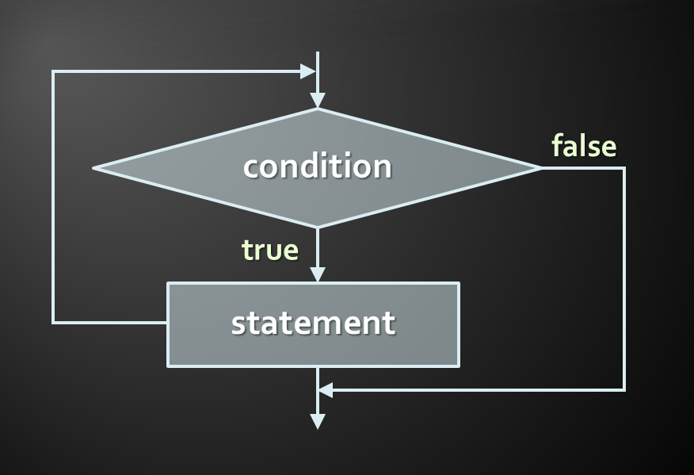
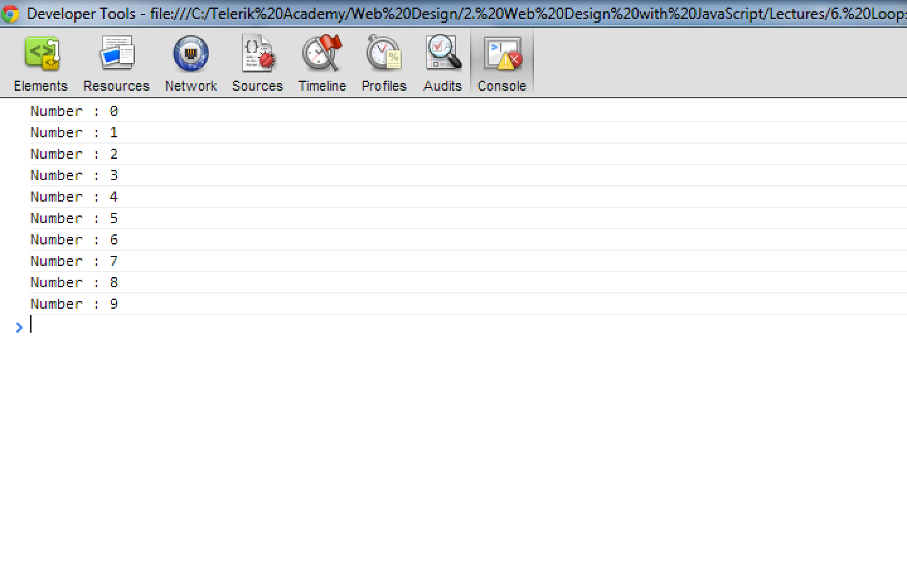
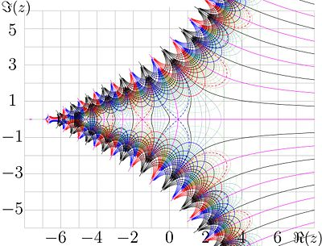
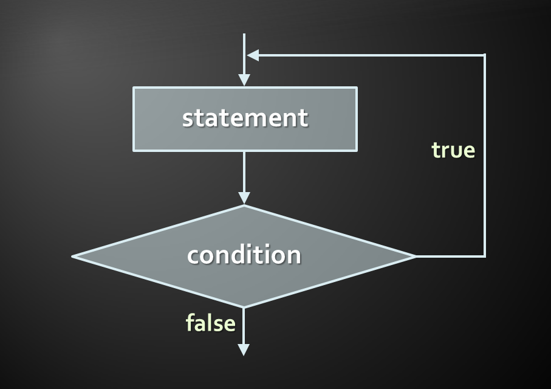

<!-- section start -->
<!-- attr: {  class:'slide-title', showInPresentation:true, hasScriptWrapper:true, style:'font-size: 0.9em' } -->
# Loops
## Execute Blocks of Code Multiple Times

<!--  -->
<!--  -->

<div class="signature">
	<p class="signature-course">Javascript Fundamentals</p>
	<p class="signature-initiative">Telerik Software Academy</p>
	<a href="https://telerikacademy.com" class="signature-link">https://telerikacademy.com</a>
</div>


<!-- section start -->
<!-- attr: { hasScriptWrapper:true } -->
# Table of Contents
- [What is a Loop?](#what-is-a-loop)
- Loops in JavaScript
  - [`while` loop](#while-loop)
  - [`do … while` loop](#do-while-loop)
  - [`for` loops](#for-loops)
  - [`break`, `continue`](#break-continue)
- [Nested loops](#nested-loops)

<!--  -->

<!-- attr: { id:'what-is-a-loop' } -->
# <a id="what-is-a-loop"></a>What is a loop?
- A loop is a **control statement** that allows **repeating the execution of a block of statements**
  - May execute a code block fixed number of times
  - May execute a code block while given condition holds
  - May execute a code block for each member of a collection
- Loops that never end are called an **infinite loops**


<!-- section start -->
<!-- attr: { id:'while-loop', class:'slide-section', hasScriptWrapper:true } -->
# <a id="while-loop"></a>`while` loop

<!--  -->

<!-- attr: { showInPresentation:true } -->
<!-- # How to use a `while` loop? -->
- The simplest and most frequently used loop
- Has a **repeat conditions**
  - Also called **loop condition**
  - Is not necessary strictly a `Boolean` value
  - Is evaluated to `true` or `false`
    - `5`, `'non-empty'`, `{}`, etc.. are evaluated as true
    - `0`, `''`, `null`, `undefined` are evaluated as false

```js
while (condition) {
    statements;
}
```


<!-- attr: { hasScriptWrapper:true } -->
# `while` loop – How It Works?




<!-- attr: { hasScriptWrapper:true } -->
# `while` loop – _Examples_

```js
let counter = 0;
while (counter < 10) {
    console.log('Number : ' + counter);
    counter += 1;
}
```

<!--  -->


# Sum 1..N – _Example_
- Calculate and print the sum of the first N natural numbers

```js
let n = 123,
    sum = 0,
    operands = 'The sum 123';

while(n > 0) {
    sum += n;
    n -= 1;
    operands += '+' + n;
}

console.log(operands + ' = ' + sum);
```


# Prime Number – _Example_
- Checking whether a number is prime or not

```js
const n = 123,
    maxDivider = Math.sqrt(n);

let divider = 2,
    prime = true;

while (prime && (divider <= maxDivider)) {
   if (!(n % divider)) {
       prime = false;        
   }
   divider += 1;
}

console.log(prime);
```


<!-- attr: { class:'slide-section demo', showInPresentation:true, hasScriptWrapper:true } -->
<!-- # While Loop
## [Demo]() -->

<!-- attr: { id:'break-continue' } -->
# <a id="break-continue"></a>Using break Operator
- `break` operator exits the inner-most loop

```js
let n = 10,
    fact = 1,
    factStr = 'n! = ';

while (1) { //infinite loop
  if (n === 1) {
      break;
  }

  factStr += n + '*'
  fact *= n;
  n -= 1;
}	

factStr += '1 = ' + fact;
console.log(factStr);
```


<!-- attr: { class:'slide-section demo', showInPresentation: true, hasScriptWrapper:true } -->
<!-- # Calculating Factorial
## [Demo]() -->

<!--  -->


<!-- section start -->
<!-- attr: { id:'do-while-loop', class:'slide-section', showInPresentation:true, hasScriptWrapper:true, style:'font-size: 0.9em' } -->
# <a id="do-while-loop"></a>`do-while` loop

<!--  -->

<!-- attr: { showInPresentation:true, hasScriptWrapper:true } -->
<!-- # Using `do-while` loop -->
- Another loop structure is:
- The block of statements is repeated
  - While the boolean loop condition holds
- The loop is always **executed at least once**

```js
do {
    statements;
} while (condition);
```

<!--  -->

<!-- attr: { hasScriptWrapper:true } -->
# `do-while` statement



<!-- attr: { hasScriptWrapper:true } -->
# `do-while` - _Examples_
- Calculating `N!`
- Calculating the product of the numbers in the range `[N..M]`
- Converting a number from decimal to binary

<!--  -->


# Factorial – _Example_
- Calculating `N!`

```js
let fact = 1,
    factStr = 'n! = ';

do {
    fact *= n;
    factStr += n + '*'
    n -= 1;
} while (n);

factStr += ' = ' + fact;
console.log(factStr)
```


<!-- attr: { style:'font-size: 0.8em' } -->
# Product[N..M] – _Example_
- Calculating the product of all numbers in the range `[N..M]`:

```js
let number = n,
    product = 1,
    productStr = '';

do {		
  product *= number;		
  productStr += number;

  if (number != m) {
  	productStr += '*';
  }

  number += 1;
} while (number <= m);

productStr += ' = ' + product;
console.log(productStr);
```

# Decimal to binary - _Example_
- Converting a decimal number to it's binary representation

```js
let dec = 125,
    result = '';

do {
    result = (dec & 1) + result;
    dec >>= 1;
} while(dec > 0)

console.log(result);
```

<!-- attr: { class:'slide-section demo', showInPresentation:true, hasScriptWrapper:true } -->
<!-- # `do-while` loop
## [Demo]() -->


<!-- section start -->
<!-- attr: { id:'for-loops', class:'slide-section', showInPresentation:true, hasScriptWrapper:true } -->
<!-- # <a id="for-loops"></a>`for` loops -->

<!--  -->


# `for` loops
- The typical `for` loop syntax is:
- Consists of
  1. **Initialization statement**
  1. **Test expression that is evaluated to boolean**
  1. **Update statement**
  1. **Loop body block**

```js
for (initialization; test; update) {
    statements;
}
```


# The Initialization Expression

```js
for (let number = 0; number < 10; number += 1) {    
    // Can use number here
}

// Cannot use number here
```

- Executed once, just before the loop is entered
  - Like it is out of the loop, before it
- Usually used to declare a counter variable
  - Multiple variables can be declared in the initialization statement


# The Test Expression
- Evaluated before each iteration of the loop
  - If evaluated **true**, the loop body is executed
  - If evaluated **false**, the loop ends
- Used as a **loop condition**

```js
  for (let number = 0; number < 10; number += 1) {    
    // Can use number here
} 

// Cannot use number here
```


# The Update Expression

```js
for (let number = 0; number < 10; number += 1) {   
    // Can use number here
}

// Cannot use number here
```

- Executed at each iteration **after** the body of the loop is finished
- Usually used to update the counter
  - `for` loops support multiple update statements, separated by the `,` (comma) operator


<!-- attr: { hasScriptWrapper:true } -->
# `for` loop - _Examples_
- Print all natural numbers up to `N`
- Calculating `N!`
- Raising `N` to the power of `M`

<!--  -->


# Simple for Loop – _Example_
- A simple for-loop to print the numbers `[0..9]`:

```js
const N = 10;

for (let number = 0; number < N; number += 1) {
    console.log(number + ' ');
}
```

- A simple for-loop to calculate `N!`:

```js
let factorial = 1;
const N = 5;

for (let i = 1; i <= N; i += 1) {
    factorial *= i;
}
```


<!-- attr: { style:'font-size: 0.9em' } -->
# Complex for Loop – _Example_
- Complex `for` loops could have several counter variables:

```js
for (let i = 1, sum = 1, N = 128; i <= N; i *= 2, sum += i) {
    console.log('i=' + i + ', sum=' +sum);
}
```


```js
// output
i=1, sum=1
i=2, sum=3
i=4, sum=7
i=8, sum=15
...
```


# N^M – _Example_
- Raising `N` to power `M` (denoted as `N^M`):

```js
const N = 3,
      M = 5;

let result = 1;

for (let i = 0; i < M; i += 1) {
	  result *= N;
}

console.log(result);
```

<!-- attr: { class:'slide-section demo', showInPresentation:true, hasScriptWrapper:true } -->
<!-- # `for` loop
## [Demo]() -->


<!-- section start -->
<!-- attr: { id:'nested-loops', class:'slide-section', showInPresentation:true, hasScriptWrapper:true } -->
<!-- # <a id="nested-loops"></a>Nested loops -->

<!--  -->


# What Is Nested Loop?
- A **composition of loops** is called a nested loop
  - A loop inside another loop
- _Example_:

```js
for (let i = 0; i < 10; i += 2) {
    for (let j = 0; j < 20; j += 1) {
        while(i !== j) {
            console.log(i);
            j += 1;
        }
    }
}
```

<!-- attr: { hasScriptWrapper:true } -->
# Nested Loops - _Examples_
- Triangle of numbers
- Print all prime numbers in the range `[N..M]`
- Happy numbers
- Print all 6/49 combinations

<!--  -->

<!-- attr: { style:'font-size: 0.9em' } -->
# Triangle – _Example_
- Print the following triangle:

```
1
1 2
...
1 2 3 ... N
```

```js
const N = 7;
let result = '';

for(let row = 1; row <= N; row += 1) {
   for(let column = 1; column <= row; column += 1) {
      result += column + ' ';
   }

   result += '\n';
}	

console.log(result);
```

<!-- attr: { style: 'font-size: 0.8em' } -->
# Primes[N..M] – _Example_
- Print all prime numbers in the interval `[N..M]`:

```js
const N = 5, M = 20;
let result = '';

for (let number = N; number <= M; number += 1) {

    const maxDivider = Math.sqrt(number);
    let isPrime = true,
        divider = 2;

    while (divider <= maxDivider) {
        if (!(number % divider)) {
            isPrime = false;
            break;
        }
        divider += 1;
    }
    if (isPrime) {
        result += number + ' ';
    }
}
```

# Happy numbers – _Example_
- Print all four digit numbers in format **ABCD** such that **A**+**B** = **C**+**D** (known as happy numbers)

```js
for (a =1 ; a <= 9; a += 1) {
  for (b = 0; b <= 9; b += 1)
    for (c = 0; c <= 9; c += 1)
      for (d = 0; d <= 9; d += 1)
        if (a + b == c + d)
            console.log(`${a} ${b} ${c} ${d}`);
  }
```


# TOTO 6/49 – _Example_
- Print all combinations from TOTO 6/49

```js
for (let i1 = 1; i1 <= 44; i1 += 1)
  for (let i2 = i1 + 1; i2 <= 45; i2 += 1)
    for (let i3 = i2 + 1; i3 <= 46; i3 += 1)
      for (let i4 = i3 + 1; i4 <= 47; i4 += 1)
        for (let i5 = i4 + 1; i5 <= 48; i5 += 1)
          for (let i6 = i5 + 1; i6 <= 49; i6 += 1)
            console.log(
            `${i1}, ${i2}, ${i3}, ${i4}, ${i5}, ${i6}`);		
```


<!-- attr: { class:'slide-section demo', showInPresentation:true, hasScriptWrapper:true } -->
<!-- # Nested loops
## [Demo]() -->

# `for-in` loop
- `for-in` loop **iterates over the properties of an object**
  - When the object is **array**, **nodeList** or **liveNodeList**, `for-in` iterates over their **elements**
  - When the object is not a collection, `for-in` iterates over **its properties**


# `for-in` - _Example_
- Iterating over the properties of **document**

```js
// propName is a string - the name of the property
for (const propName in document) { 
    console.log(document[propName]);
}
```

- Iterating over the elements of an array 

```js
const arr = [1, 2, 3, 4, 5, 6];

for (const index in arr) {
    console.log(arr[index]);
}
```

<!-- attr: { style:'font-size: 0.9em' } -->
# `for-of` loop
- `for-of` loop **iterates over the elements in an array**
  - Can be used only on arrays, or array-like objects
    - i.e. the arguments object

```js
const arr = ['One', 'Two', 'Three', 'Four'];

for(const n of arr) { 
  console.log(n); 
}
```

- The for-of loop is **part of the ECMAScript 6** standard
  - Supported in all modern browsers

<!-- attr: { class:'slide-section demo', showInPresentation:true, hasScriptWrapper:true } -->
<!-- # `for-in` and `for-of`
## [Demo]() -->

<!-- section start -->

<!-- attr: { class:'slide-section', showInPresentation: true } -->
<!-- # Loops
## Questions? -->

<!-- attr: { hasScriptWrapper:true } -->
# Free Trainings @ Telerik Academy
- "Web Design with HTML 5, CSS 3 and JavaScript" course @ Telerik Academy
    - [javascript course](http://academy.telerik.com/student-courses/web-design-and-ui/javascript-fundamentals/about)
  - Telerik Software Academy
    - [academy.telerik.com](academy.telerik.com)
  - Telerik Academy @ Facebook
    - [facebook.com/TelerikAcademy](facebook.com/TelerikAcademy)
  - Telerik Software Academy Forums
    - [forums.academy.telerik.com](http://telerikacademy.com/Forum/Home)

<!--  -->
<!--  -->
<!--  -->
<!--  -->


