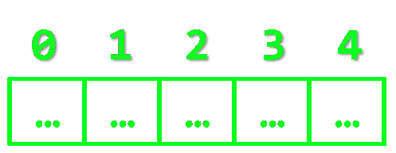
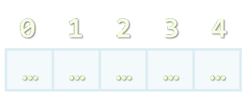
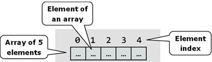
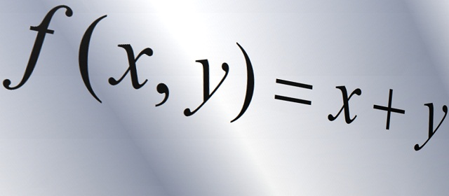

<!-- section start -->

<!-- attr: { class:'slide-title', showInPresentation: true, hasScriptWrapper: true} -->
# Arrays
## Processing Sequences of Elements

<div class="signature">
	<p class="signature-course">JavaScript Fundamentals</p>
	<p class="signature-initiative">Telerik Software Academy</p>
	<a href="https://telerikacademy.com" class="signature-link">https://telerikacademy.com</a>
</div>

<!-- section start -->

# Table of Contents

- Declaring and Creating Arrays
- Accessing Array Elements
- Processing Array Elements
- Dynamic Arrays
- Operations with arrays:
  - Concatenation
  - Slicing
  - Manipulation

<!--  -->

<!-- section start -->

<!-- attr: {class: 'slide-section', showInPresentation: true, hasScriptWrapper: true}  -->
# Arrays Overview
##  What are arrays? How to use arrays?

<!-- attr: {hasScriptWrapper: true} -->
# What are Arrays?
- An **array** is a sequence of elements
  - The order of the elements is fixed
  - Does not have fixed size
    - Can get the current length (`Array.length`)



<div class="fragment balloon" style="top:43%; left:30%; width:20.83%">Array of 5 elements</div>
<div class="fragment balloon" style="top:50%; left:64%; width:18.33%">Element index</div>
<div class="fragment balloon" style="top:70%; left:25.69%; width:22.17%">Element of an array</div>


# Declaring Arrays
- Declaring an array in JavaScript

```js
// Array holding integers
var numbers = [1, 2, 3, 4, 5];

// Array holding strings
var weekDays = ['Monday', 'Tuesday', 'Wednesday',
  'Thursday', 'Friday', 'Saturday', 'Sunday']

// Array of different types
var mixedArr = [1, new Date(), 'hello'];

// Array of arrays (matrix)
var matrix = [
  ['0,0', '0,1', '0,2'],
  ['1,0', '1,1', '1,2'],
  ['2,0', '2,1', '2,2']];			
```

<!-- attr: {showInPresentation: true} -->
<!-- # Declare and Initialize Arrays -->

- Initializing an array in JavaScript can be done in three ways:
  - Using `new Array(elements)`:

    ```js
    var arr = new Array(1, 2, 3, 4, 5);
    ```

  - Using `new Array(initialLength)`:

    ```js
    var arr = new Array(10);
    ```

  - Using `array literal` (recommended):

    ```js
    var arr = [1, 2, 3, 4, 5];
    ```

<!--  -->

<!-- attr: {class: 'slide-section', showInPresentation: true} -->
<!-- # Creating Arrays -->
## [Demo]()
<!--  -->
<!--  -->
<!--  -->

<!-- section start -->

<!-- attr: {class: 'slide-section', showInPresentation: true} -->
<!-- # Using arrays
## Read and Modify Elements by Index -->
<!--  -->

# How to Access Array Element?

- Array elements are accessed using the **indexer operator**: `[]` (square brackets)
  - Array indexer takes element’s index as parameter in the range `[0; length-1]`
  - The first element has index `0`
  - The last element has index `length-1`
- Array elements can be retrieved and changed by the `[]` (indexer) operator

<!-- attr: {showInPresentation: true} -->
<!-- # Reversing an Array – _Example_ -->

- _Example:_ Reversing the elements of an array

```js
//always declare var variables on the top of the scope!
var array,
    len,
    reversed,
    i,
    j;

array = [1, 2, 3, 4, 5];
reversed = [];

for (i = 0, len = array.length; i < len; i += 1) {
    j = len - i - 1;
    reversed.push(array[j]);
}
```

<!-- attr: {class: 'slide-section', showInPresentation: true} -->
<!-- # Reversing an Array -->
## [Demo]()
<!--  -->
<!--  -->
<!--  -->


<!-- section start -->

<!-- attr: {class: 'slide-section', showInPresentation: true} -->
<!-- # Iterating Arrays -->

<!--  -->

# Iterating Arrays with `for`
- Use `for` loop to process an array when you need to keep track of the index
- In the loop body use the element at the loop index (`array[index]`):

```js
var i, len;
for (i = 0, len = array.length; i < len; i += 1) {
   squares[i] = array[i] * array[i];
}
```

<!-- attr: { style: 'font-size:0.9em', showInPresentation: true} -->
<!-- # Iterating Arrays with `for` -->
- _Example:_ Printing array of numbers in reversed order:

```js
var arr, i, len;
arr = [1, 2, 3, 4, 5];
for (len = arr.length, i = len - 1; i >= 0; i -= 1) {
    console.log(arr[i]);
}
// Result: 5 4 3 2 1
```

- _Example:_ Initialize all array elements with their corresponding index number:

```js
var i, len
for (i = 0, len = array.length; i < len; i += 1) {
    array[i] = i;
}
```

# Iterating Arrays using `for-in`
- How `for-in` loop works?
  - `index` iterates through the indexes of the array
- Used when the indexes are unknown
  - All elements are accessed one by one
  - Order is not guaranteed
  - Works for objects as well

```js
var index;
for (index in array) {
  // great code
}
```

<!--  -->

<!-- attr: {showInPresentation: true} -->
<!-- # Iterating Arrays with `for-in` -->

- Print all elements of an array of strings:

```js
var capitals, i;
capitals = [
    'Sofia',
    'Washington',
    'London',
    'Paris'
];

for (i in capitals) {
    console.log(capitals[i]);
}
```


<!-- attr: {class: 'slide-section', showInPresentation: true} -->
<!-- # Processing Arrays -->
## [Demo]()
<!--  -->


<!-- section start -->

<!-- attr: {class: 'slide-section', showInPresentation: true} -->
<!-- # Inserting and Removing Elements from Arrays
##  `push`, `pop`, `shift`, `unshift` -->

<!--  -->
<!--  -->
<!--  -->


# Inserting and Removing Elements from Arrays

- All arrays in JavaScript are **dynamic**
  - Their size can be changed at runtime
  - New elements can be inserted to the array
  - Elements can be removed from the array

<!-- attr: {showInPresentation: true} -->
<!-- # Inserting and Removing Elements from Arrays
- Methods for array manipulation: -->
  - `Array#push(element)`
    - **Inserts** a new element at the **tail** of the array
  - `Array#pop()`
    - **Removes** the element at the **tail**
    - **Returns** the removed element

<!-- attr: {showInPresentation: true} -->
<!-- # Inserting and Removing Elements from Arrays
- Methods for array manipulation (cont.) -->
  - `Array#unshift(element)`
    - **Inserts** a new element at the **head** of the array
  - `Array#shift()`
    - **Removes** the element at the **head**
    - **Returns** the remove element

<!-- attr: {class: 'slide-section', showInPresentation: true} -->
<!-- # Inserting and Removing Elements from Arrays -->
## [Demo](/)
<!--  -->


<!-- section start -->

<!-- attr: {class: 'slide-section', showInPresentation: true} -->
<!-- # Array Methods
##  Reversing, joining, etc... -->
<!--  -->
<!--  -->

<!-- attr: { style: 'font-size: 0.8em'} -->
# Array Methods

- `Array#reverse()`
  - **Reverses** the elements of the array
  - **Returns** a new arrays

  ```js
  var items = [1, 2, 3, 4, 5, 6];
  var reversed = items.reverse();
  //reversed = [6, 5, 4, 3, 2, 1]
  ```

- `Array#join(separator)`
  - **Concatenates** the elements with a separator
  - **Returns** a string

  ```js
  var names = ["John", "Jane", "George", "Helen"];
  var namesString = names.join(", ");
  //namesString = "John, Jane, George, Helen"
  ```

  <!-- attr: { style: 'font-size: 0.8em'} -->
# Concatenating Arrays
- `arr1.concat(arr2)`
  - **Inserts** the elements of `arr2` at the **end** of `arr1`
  - **Returns** a new array
  - `arr1` and `arr2` remain unchanged!

  ```js
  var arr1 = [1, 2, 3];
  var arr2 = ["one", "two", "three"];
  var result = arr1.concat(arr2);
  //result = [1, 2, 3, "one", "two", "three"]
  ```

- Adding the elements of an array to other array

  ```js
  var arr1 = [1, 2, 3];
  var arr2 = ["one", "two", "three"];
  [].push.apply(arr1, arr2);
  //arr1 = [1, 2, 3, "one", "two", "three"]
  ```

# Getting Parts of Arrays
- `Array#slice(fromIndex [, toIndex])`
  - **Returns a new array**
    - A shallow copy of a portion of the array
  - The new array contains the elements from indices `fromIndex` to `to` (excluding `toIndex`)
  - Can be used to clone an array

  ```js
  var items = [1, 2, 3, 4, 5];
  var part = items.slice(1, 3);
  //part = [2, 3]
  var clonedItems = items.slice();  
  ```

# Splicing Arrays

- `Array#splice(index, count, elements)`
  - Removes `count` elements, starting from `index` position
  - Adds `elements` at position `index`
  - Returns a new array, containing the removed elements

  ```js
  var numbers = [1, 2, 3, 4, 5, 6, 7];
  var result = numbers.splice(3, 2, "four", "five", "five.five");
  //result = [4, 5]
  //numbers = [1, 2, 3, "four", "five", "five.five", 6, 7];
  ```

<!-- attr: {showInPresentation: true} -->
<!-- # Splicing Arrays
- `Array#splice(index, count, elements)` -->

  - Example uses:
    - Remove elements from any index of the array:

      ```js
      //removes a single element at position index
      items.splice(index, 1);
      //removes count elements starting from position index
      items.splice(index, count);  
      ```

    -  Insert elements at any index of the array:

      ```js
      //Inserts a single element at position index
      items.splice(index, 0, element);
      //Inserts many elements starting from position index
      items.splice(index, 0, item1, item2, item3);  
      ```

<!-- attr: { style: 'font-size: 0.9em'} -->
#  Searching in Arrays

- `Array#indexOf(element [, rightOf])`
  - Returns the index of the first match in the array
  - Returns `-1` is the element is not found
- `Array#lastIndexOf(element, [leftOf])`
  - Returns the index of the first match in the array
  - Returns `-1` is the element is not found
- `Array#indexOf()` and `Array#lastIndexOf()` do not work in all browsers
  - Need to be shimmed

# Other Arrays Functions
- Arrays official documentation:
  - https://developer.mozilla.org/en-US/docs/Web/JavaScript/Reference/Global_Objects/Array
- Checking for array
  - `typeof([1, 2, 3]) -> object`
    - Not working
  - `Array.isArray([1, 2, 3]) -> true`
  - Supported on all modern browsers

<!-- section start -->

<!-- attr: {class: 'slide-section'} -->
# Arrays
##  Questions
<!--  -->
<!--  -->
<!--  -->
<!--  -->
<!--  -->

# Free Trainings @ Telerik Academy
- "Web Design with HTML 5, CSS 3 and JavaScript" course @ Telerik Academy
    - html5course.telerik.com
  - Telerik Software Academy
    - academy.telerik.com
  - Telerik Academy @ Facebook
    - facebook.com/TelerikAcademy
  - Telerik Software Academy Forums
    - forums.academy.telerik.com

<!--  -->
<!--  -->
<!--  -->
<!--  -->
