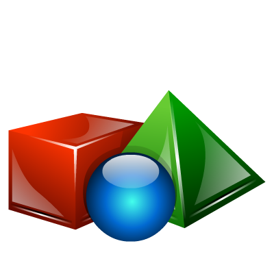
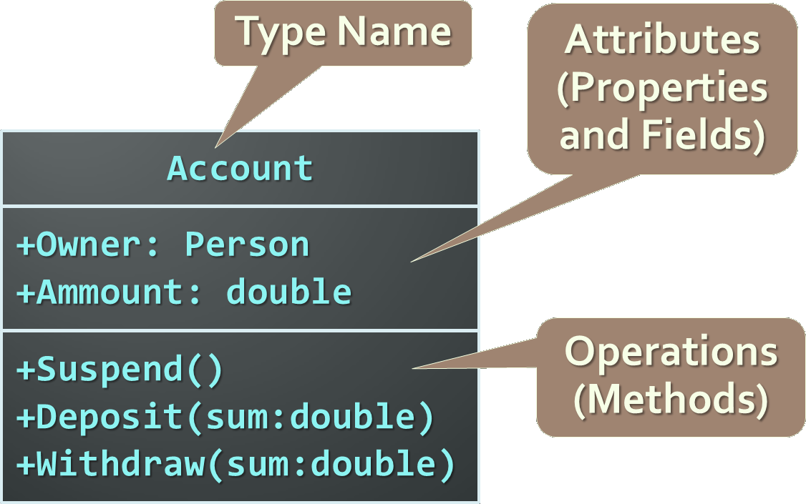
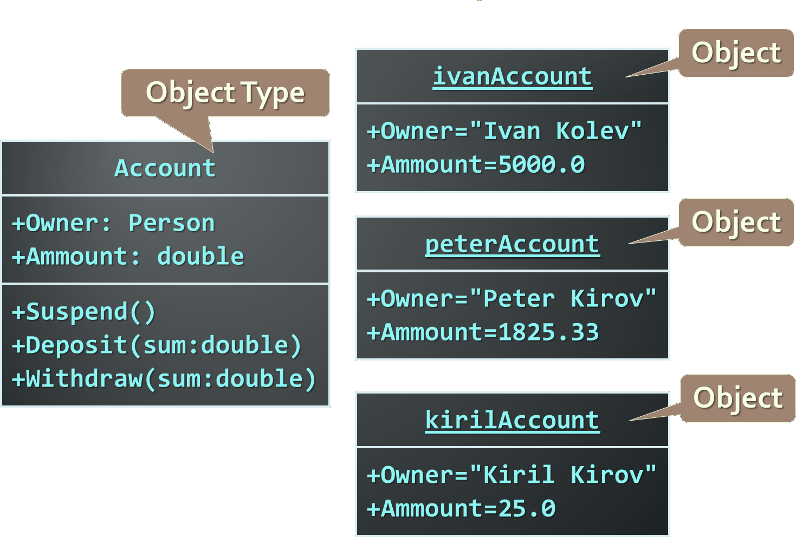

<!-- section start -->
<!-- attr: { hasScriptWrapper:true, class:'slide-title' } -->
# Using Objects
## Objects, Properties, Primitive and Reference Types

<!--  -->

<div class="signature">
	<p class="signature-course">Javascript Fundamentals</p>
	<p class="signature-initiative">Telerik Software Academy</p>
	<a href="https://telerikacademy.com" class="signature-link">https://telerikacademy.com</a>
</div>

<!-- section start -->
<!-- attr: { hasScriptWrapper:true } -->
# Table of Contents
- [Object Types and Objects](#objects)
- [JavaScript Objects Overview](#js-objects)
- [Object and Primitive Types](#object-primitives)
- [JavaScript Object Literal](#object-literal)
- [JavaScript Object Properties](#object-props)
  - [Dot notation](#dot-notation)
  - [Associative Arrays](#assoc-arrays)

<!-- section start -->
<!-- attr: { hasScriptWrapper:true, class:'slide-section', id:'objects', showInPresentation: true } -->
<!-- # <a id="objects"></a>Object Types and Objects
## Modeling Real-world Entities with Objects -->

<!--  -->

<!-- attr: { hasScriptWrapper:true } -->
# What are Objects?
- Software objects model real-world objects or abstract concepts
  - _Examples_:
    - bank, account, customer, dog, bicycle, queue
- Real-world objects have **states** and **behaviors**
  - Account states:
    - holder, balance, type
  - Account behaviors:
    - withdraw, deposit, suspend

<!-- attr: { hasScriptWrapper:true, showInPresentation:true } -->
<!-- # What are Objects? -->
- How do software objects implement real-world objects?
  - Use variables/data/properties to implement states
  - Use methods/functions to implement behaviors
- An object is a software bundle of variables and related methods

<!--  -->

<!-- attr: { hasScriptWrapper:true } -->
# Objects Represent
- Things from the real world
  - checks
  - people
  - shopping list
- Things from the computer world
  - numbers
  - characters
  - queues
  - arrays

<!-- attr: { hasScriptWrapper:true } -->
# What is a Object Type?
- The formal definition of an **object type**:
  - Definition by Google

**Object types** act as templates from which an instance of an object is created at run time.
Types define the properties of the object and the methods used to control the object's behavior.

<!-- attr: { hasScriptWrapper:true } -->
# Object Types
- Object Types provide the structure for objects
  - Define their prototype, act as template
- Object Types define:
  - Set of **attributes**
    - Represented by variables and properties
    - Hold their **state**
  - Set of actions - their **behavior**
    - Represented by methods
- A type defines the methods and types of data associated with an object

<!-- attr: { hasScriptWrapper:true, showInPresentation:true } -->
<!-- # Object Types – _Example_ -->



<!-- attr: { hasScriptWrapper:true } -->
# Objects
- An **object** is a concrete **instance** of a particular object type
- Creating an object from an object type is called **instantiation**
- Objects have state
  - Set of values associated to their attributes
- _Example_:
  - _Type:_ Account
  - _Objects:_ Ivan's account, Peter's account

<!-- attr: { hasScriptWrapper:true, showInPresentation:true } -->
<!-- # Objects – _Example_ -->



<!-- section start -->
<!-- attr: { hasScriptWrapper:true, class:'slide-section', id:'js-objects', showInPresentation: true } -->
<!-- # <a id="js-objects"></a>Objects
## Collection of fields and methods -->

<!-- attr: { hasScriptWrapper:true } -->
# Objects Overview
- JavaScript is designed on a simple object-based paradigm
  - An object is a collection of **properties**
- An object property is association between a name and a value
  - A value of property can be either a **method** (function) or a **field** (variable)
- Lots of predefined objects available in JS
  - `Math`, `document`, `window`, etc…
- Objects can be created by the developer

<!-- attr: { hasScriptWrapper:true } -->
# Object Properties
- Each object has **properties**
  - Properties are values attached to the object
  - Properties of an object can be accessed with a dot-notation (`.` operator) or with `[]` - indexer:

```js
let arrStr = arr.join(', '); // property join of Array
let length = arr.length;  // property length of Array
let words = text.split(' ');
let words = text['split'](' ');
```

<!-- section start -->
<!-- attr: { hasScriptWrapper:true, class:'slide-section', id:'object-primitives', showInPresentation: true } -->
<!-- # <a id="object-primitives"></a>Reference and Primitive Types
## Passing by value, passing by reference -->

<!-- attr: { hasScriptWrapper:true, style:'font-size:0.9em' } -->
# Reference and Primitive Types
- JavaScript is a **weakly typed** language
  - Variables don’t have type, but their values do
- JavaScript has **six** different types:
  - `Number`, `String`, `Boolean`, `Null`, `Undefined` and `Object`
- `Object` is the only reference type
  - It is passed by **reference** (every time an object's value is used, it's used through a reference)
- `Number`, `String`, `Boolean`, `Null`, `Undefined` are **primitive** types
  - Passed by **value** (they're copied each time their value is used)

<!-- attr: { hasScriptWrapper:true, showInPresentation:true, style:'font-size:0.8em' } -->
<!-- # Reference and Primitive Types -->
- The primitive types are `Boolean`, `Number`, `String`, `Undefined` and `Null`
  - All the other types are actually of type `object`
    - Including arrays, dates, custom types, etc…

```js
// all of those are true
console.log(typeof new Object() === typeof new Array());
console.log(typeof new Object() === typeof new Date()); 
console.log(typeof new Array() === typeof new Date());
```

- All types derive from `Object`
  - Their type is `object`

<!-- attr: { hasScriptWrapper: true } -->
# Pass by value vs. Pass by reference


<!-- attr: { hasScriptWrapper:true, style:'font-size:0.9em' } -->
# Primitive Types
- Primitive types are passed **by value**
  - When passed as argument
    - New memory is allocated
    - The value is copied in the new memory
    - The value in the new memory is passed
- Primitive types are initialized with type literals
- Primitive types have a object type **wrapper**

```js
let number = 5, // Holds a primitive value of 5
    text = 'Hello there!', // Holds a primitive value
    numberObj = new Number(5); // Holds an object value of 5
```

<!-- attr: { hasScriptWrapper:true, showInPresentation:true } -->
<!-- # Primitive Types – _Example_ -->
- Assign string values to two variables
  - Create an object using their value
  - Change the value of the variables
  - Each object has its own value

```js
let fname = 'Peter',
    lname = 'Johnson',
    person = { firstName: fname, lastName: lname };
lname = 'Peterson';
console.log(person.lastName) // logged 'Johnson'
```

<!-- attr: { hasScriptWrapper:true } -->
# Reference Type
- `Object` is the only **reference type**
  - When passed it's value is used somewhere, it is not copied, but instead a reference to it is passed

```js
let marks = [
  { subject : 'JavaScript', score : 4.50 },
  { subject : 'OOP', score : 5.00 },
  { subject : 'HTML5', score : 6.00 },
  { subject : 'Photoshop', score : 4.00 }];

let student = { name: 'Doncho Minkov', marks: marks };
marks[2].score = 5.50;

console.log(student.marks);
// logs 5.50 for HTML5 score
```

<!-- section start -->
<!-- attr: { hasScriptWrapper:true, class:'slide-section', id:'object-literal', showInPresentation:true } -->
<!-- # <a id="object-literal"></a>JavaScript Object Literal
## Curly brackets `{}` -->

<!-- attr: { hasScriptWrapper:true } -->
# JavaScript Object Literal
- JavaScript object literal is a simplified way to create objects
  - Using curly brackets:

```js
let person = {
  firstName: 'Doncho',
  lastName: 'Minkov',
  toString: function () {
    return this.firstName + ' ' + this.lastName;
  }
};

// object properties can be used:
console.log(person.toString());
// writes 'Doncho Minkov'
```

<!-- attr: { hasScriptWrapper:true, style:'font-size:0.8em' } -->
# Creating Objects
- Lets make two people:

```js
let minkov, georgiev;
minkov = {
  fname: 'Doncho',
  lname: 'Minkov',
  toString: function() {
    return this.fname + ' ' + this.lname;
  }
};
georgiev = {
  fname: 'Georgi',
  lname: 'Georgiev',
  toString: function() {
    return this.fname + ' ' + this.lname;
  }
};
```

- Object notations are great, but **repeating code** is not, right?

<!-- attr: { hasScriptWrapper:true, style:'font-size:0.9em' } -->
# Object Building Function
- Using a function for building objects
  - Just pass first and last name and get a object
    - Something like a constructor

```js
let minkov, georgiev;
function makePerson(fname, lname) {
  return {
    fname: fname,
    lname: lname,
    toString: function () {
      return this.fname + ' ' + this.lname;
	}
  }
}
minkov = makePerson('Doncho', 'Minkov');
georgiev = makePerson('Georgi', 'Georgiev');
```

- Much cooler, right?

<!-- section start -->
<!-- attr: { hasScriptWrapper:true, class:'slide-section', id:'object-props', showInPresentation:true } -->
<!-- # <a id="object-props"></a>JS Object Properties
## Dot-notation, associative arrays -->

<!-- attr: { hasScriptWrapper:true, showInPresentation:true, id:'dot-notation' } -->
# <a id="dot-notation"></a>JS Object Properties
- JavaScript objects are just a set of key/value pairs
  - Each value can be accessed by its key
  - Properties in objects are accessed using the dot-notation (`obj.property`)
  - Yet properties can be used with brackets
    - Like an array

```js
document.write === document['write']
```

<!-- attr: { hasScriptWrapper:true, style:'font-size:0.9em', id:'assoc-arrays' } -->
# <a id="assoc-arrays"></a>Associative Arrays
- Objects can be used as **associative arrays**
  - The key (index) is string instead of number
    - Also called **dictionaries** or **maps**
- Associative arrays don't have array properties
  - `length`, `indexOf`, etc…

```js
function countWords(words) {
  let word,
      wordsCount = {};
  for (let i in words) {
    word = words[i].toLowerCase();
    if (!wordsCount[word]) { wordsCount[word] = 0; }
    wordsCount[word] += 1;
  }
  return wordsCount
}
```

<!-- section start -->
<!-- attr: { hasScriptWrapper:true, showInPresentation:true, class:'slide-section' } -->
<!-- # Using Objects
## Questions? -->

<!-- attr: { hasScriptWrapper:true } -->
# Free Trainings @ Telerik Academy
- "Web Design with HTML 5, CSS 3 and JavaScript" course @ Telerik Academy
  - [javascript course](http://academy.telerik.com/student-courses/web-design-and-ui/javascript-fundamentals/about)
- Telerik Software Academy
  - [academy.telerik.com](http://academy.telerik.com)
- Telerik Academy @ Facebook
  - [facebook.com/TelerikAcademy](https://facebook.com/TelerikAcademy)
- Telerik Software Academy Forums
  - [forums.academy.telerik.com](https://telerikacademy.com/Forum/Home)

<!--  -->
<!--  -->
<!--  -->
<!--  -->
